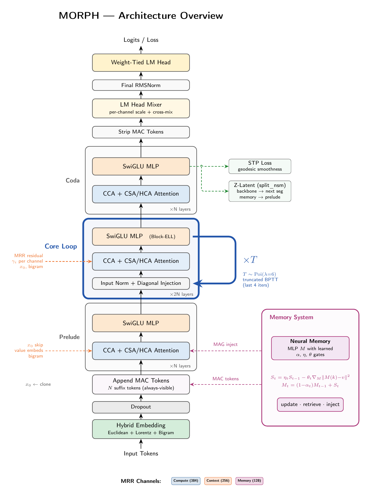
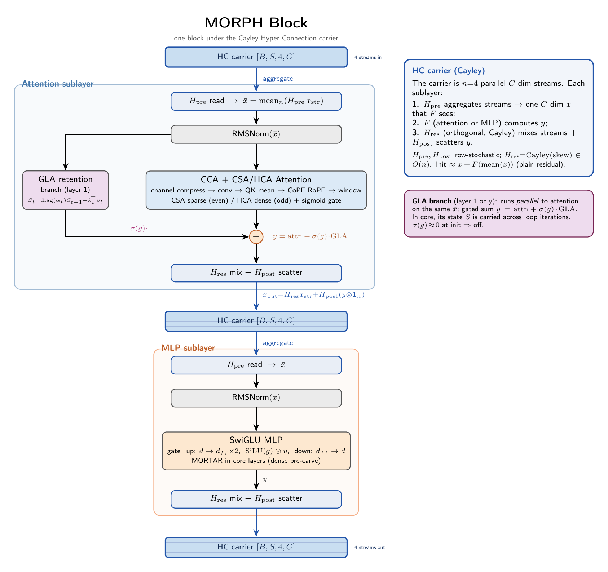
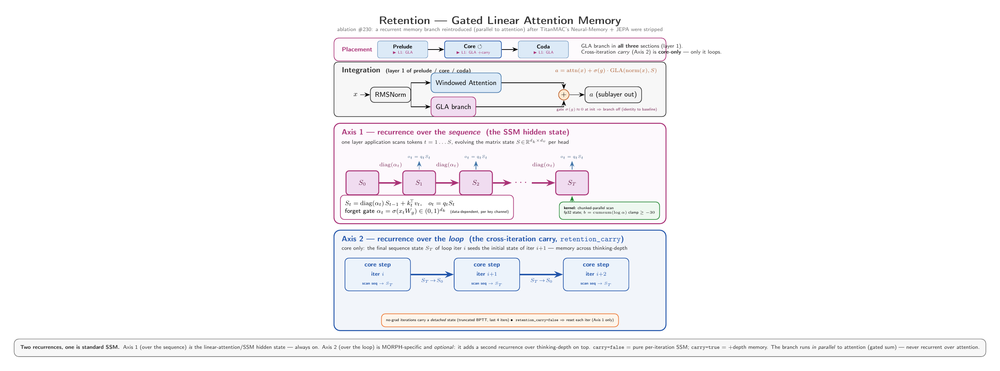
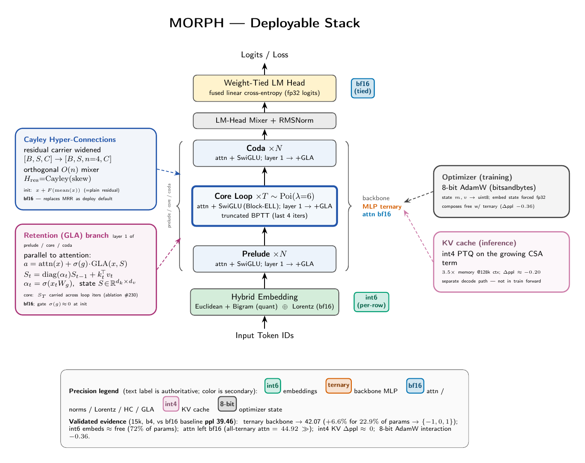

# MORPH

**MORPH Orchestrates Recursive Pruned Hierarchies**

A looped transformer that maximizes per-parameter capability with depth, then prunes what's left. MORPH reuses a small set of layers many times (Parcae looping), stabilizes that reuse with multi-channel residual dynamics, and prunes the looped layers to extreme sparsity using learned topology — all in a single training run.

The result: a model that matches dense transformers with far fewer parameters and FLOPs.

> **Note:** Earlier versions of MORPH (TitanMAC lineage) augmented the backbone with a
> gradient-based neural memory, MAC tokens, and a LeJEPA split_nsm z-latent objective. All
> three were **removed**. The STP (Semantic Tube Predictor) regularizer is retained. The
> recurrent-memory role is now explored by the **GLA retention branch** (ablation #230) — a
> gated linear-attention SSM in parallel to attention on layer 1 of each section. The residual
> mechanism is **Cayley Hyper-Connections** (`residual_mode=hc_cayley`, n=4 streams) by default;
> the older Multi-Rate Residual is a selectable alternative (`residual_mode=null`). The diagrams
> below were regenerated to reflect this (see `docs/figures/*.tex`).

---

## Architecture Overview

<p align="center">
  
</p>

Data flows top-to-bottom through four stages:

1. **Hybrid Embedding** — Input tokens are embedded via a combination of Euclidean, Lorentz, and bigram embeddings. The Lorentz component provides hyperbolic geometry for hierarchical token relationships.

2. **Prelude** (N layers) — Standard transformer blocks that establish initial representations.

3. **Core Loop** (2N layers, iterated T times) — The heart of the architecture. The same set of layers is reused T times with diagonal injection at the loop boundary (Parcae-style, spectral radius < 1 guaranteed). Depth T is sampled from a Poisson distribution during training and truncated BPTT limits the backward pass to the last 4 iterations. The core MLP layers use the MORTAR 128×128 BCSR sparse format for extreme pruning.

4. **Coda** (N layers) — Post-loop layers that refine the representation. After the coda, the output goes through the LM head.

The **STP loss** enforces smooth (locally geodesic) token-state trajectories during pretraining — a geometric regularizer that improves generation quality without affecting teacher-forced perplexity.

---

## The MORPH Block

<p align="center">
  
</p>

The residual stream is carried as **Cayley Hyper-Connections (HC)** — `n=4` parallel d<sub>model</sub>-dim streams `[B,S,4,C]` (deployment default, `residual_mode=hc_cayley`). Around each sublayer the streams are read, transformed, and written back:

1. **H<sub>pre</sub>** (row-stochastic) aggregates the streams into a single d<sub>model</sub>-dim input `x̄ = mean_n(H_pre · x_streams)` that the sublayer sees;
2. the sublayer **F** (attention or MLP) computes `y = F(RMSNorm(x̄))`;
3. **H<sub>res</sub>** (an orthogonal map, `Cayley(skew) ∈ O(n)`) mixes the streams and **H<sub>post</sub>** scatters `y` back: `x_out = H_res · x_streams + H_post · (y ⊗ 1_n)`.

At init the maps reduce to `x + F(mean(x))` — a plain residual — so HC starts bit-identical to a vanilla block and learns its mixing from there.

**Why this matters for looping**: when the same layers execute T times, a standard residual would amplify signals by T&times;. HC's orthogonal H<sub>res</sub> (Cayley ∈ O(n)) preserves the residual-stream norm across iterations (exact dynamical isometry), so the carrier neither explodes nor collapses over T=6–8 loops. This is what makes deep looping stable.

**Layer 1 of each section** also adds a **GLA retention branch** in parallel to attention — a gated linear-attention SSM whose hidden state `S_t = diag(α_t)·S_{t-1} + kₜᵀvₜ` summarizes the sequence, combined as `y = attn(x̄) + σ(g)·GLA(x̄, S)`. In the core loop, `S` is carried across iterations (memory across thinking-depth). The gate `σ(g) ≈ 0` at init, so it is off until the model learns to open it (ablation #230).

**Alternative residual (MRR).** Setting `residual_mode=null` selects the **Multi-Rate Residual** — a single-stream `[B,S,C]` carrier split into compute (3N, &gamma;≈1.0) / context (2N, &gamma;≈0.5) / memory (N, &gamma;≈0.1) channels with per-channel learned gains. The slow channel damps loop amplification the way HC's orthogonal mixer does. MRR is a selectable ablation arm, not the deployment default. Note the **channel slices persist under HC** — not as the residual mechanism, but as the targets for injection (x₀/value-embeds → context slice; bigram full-width) and the core's spectral-radius-&lt;1 diagonal decay.

### Block internals

Each block has two sublayers with identical HC structure:

1. **H<sub>pre</sub>** &rarr; **RMSNorm** &rarr; **Attention** (CCA + CSA/HCA) [+ GLA on layer 1] &rarr; **H<sub>res</sub> mix + H<sub>post</sub> scatter**
2. **H<sub>pre</sub>** &rarr; **RMSNorm** &rarr; **SwiGLU MLP** (MortarLinear, prunable/carvable) &rarr; **H<sub>res</sub> mix + H<sub>post</sub> scatter**

The attention mechanism combines:
- **CCA** (Cross-Chunk Attention): The primary attention path with channel compression and CoPE-RoPE positional encoding
- **CSA** (Chunked Sparse Attention): Used on even-numbered layers, sparse windowed attention with compression
- **HCA** (Hyper-Connection Aware attention): Used on odd-numbered layers, dense attention that respects the channel-slice structure
- A **sigmoid gate** blends the CSA/HCA outputs

---

## Retention (GLA) Memory

<p align="center">
  
</p>

After TitanMAC's explicit neural memory was removed, the recurrent-memory role is explored by a **GLA retention branch** (ablation #230) on layer 1 of each section. It has **two recurrence axes**: Axis 1 (over the *sequence*) is the standard SSM hidden state `S_t = diag(α_t)·S_{t-1} + kₜᵀvₜ` — a linear-attention scan; Axis 2 (over the *loop*) optionally carries `S_T` of one iteration into the next (`retention_carry`), giving memory across thinking-depth. The branch runs *in parallel* to attention (gated sum), never recurrent *over* it.

---

## How the Pieces Synergize

None of MORPH's components work in isolation. The architecture is designed so each piece reinforces the others:

### Looping &times; Hyper-Connections = Stable depth without parameter growth

The core loop reuses 2N layers T times, giving effective depth of 2N&middot;T with only 2N layers of parameters. But naive looping is unstable — residual magnitudes grow with each iteration.

HC solves this: the orthogonal stream mixer (H<sub>res</sub> = Cayley(skew) ∈ O(n)) preserves the residual-stream norm across iterations (dynamical isometry), so the carrier neither explodes nor collapses over T loops. The diagonal injection at loop boundaries (spectral radius < 1) adds a further stability guarantee. Together these allow T=6-8 loop iterations without divergence. *(The MRR alternative achieves the same via its slow channel, &gamma;&approx;0.1, instead of an orthogonal mixer.)*

### Looping &times; MORTAR = Multiplicative FLOP savings

Because the same weights are reused T times per forward pass, pruning the core block to 25% density doesn't just save 75% of MLP FLOPs — it saves 75% &times; T. For T=6, that's 4.5&times; the absolute FLOP reduction compared to pruning a non-looped layer.

The pruning uses CMS (Continuum Memory System) topology scoring: gradient-based importance scores accumulated over training, with periodic topology decisions that prune low-scoring blocks and optionally regrow high-potential ones.

### MORTAR &times; Triton = Actual speedup, not just parameter reduction

Structured sparsity on paper doesn't help if the runtime can't exploit it. MORPH executes carved MLPs with the vendored stk Triton BCSR kernels (morph/sparse/stk) operating directly on 128×128 blocks — measured 3.09× faster than dense at 0.25 density. After carving, the MLP layers execute only the surviving blocks — no wasted computation on zero blocks, no gather/scatter overhead.

---

## Deployable Stack

<p align="center">
  
</p>

The deployable build overlays the *validated* quantization + precision components on the architecture above (see [`docs/deployable_quant_stack.md`](docs/deployable_quant_stack.md) for the evidence per component):

- **int6 embeddings** (per-row QAT) · **ternary backbone MLP** ({-1,0,1}, forward-STE QAT) · **bf16 attention** (windowed → bandwidth-bound, low-bit loses) · **bf16** norms / Lorentz / HC / GLA · **int4 KV cache** (inference PTQ) · **8-bit AdamW** (optimizer state).
- Every knob defaults **off** → bit-identical to the bf16 baseline. The diagram's three axes are orthogonal: *precision* (per param group), *architecture carriers* (HC, GLA — always bf16, cross-cutting), and *lifecycle overlays* (8-bit optimizer = train-only, int4 KV = inference-only).

> **Scope:** this is the deployment *target*. The current retention ablation (#230) trains **dense bf16** (ternary / int6 / fp8 / int4-KV all off) so the GLA signal is isolated from quant noise — the overlays are folded in only for the deployable build.

---

## Training Pipeline

MORPH trains in a multi-phase pipeline within a single run:

```
  Dense         Prune              Compact   Settle    Route
  warmup        to 25% density     ┃         ┃         (ReMoE)
  ┃             ┃                  ┃         ┃         ┃
  0 ──── 6k ──── 6k ──────── 66k ── 66k ── ~70k ── 70k ── end
```

### Phase 1: Dense Warmup (~6k steps)
All blocks active. The model learns basic language representations with full-density MLPs. CMS gradient scores are accumulated every step to build importance estimates.

### Phase 2: Prune (~60k steps)
Starting at step ~6k, topology decisions happen every `prune_interval` steps: low-scoring blocks are removed, reducing density toward the 25% target. The model continues training through each pruning step, adapting its weights to compensate for removed capacity. This is gradual — removing 5% of remaining blocks per round over many rounds.

### Phase 3: Compact
At the target density, carve() converts the sparse mask into MORTAR BCSR storage (mortar_data + index buffers). Memory footprint drops immediately. From this point, forward/backward passes use the stk BCSR Triton kernels.

### Phase 4: Settle
Post-compact recovery training. The model adjusts to the now-permanent sparse structure. Learning rate may be reduced. This phase typically runs for a few thousand steps.

### Phase 5: Route (ReMoE) *[pending integration]*
After the model has settled into its pruned structure, per-token routing is activated over the surviving tile-groups. Different tokens activate different subsets of the remaining 25% of blocks, effectively giving each token a specialized sparse MLP.

The routing module (`morph/model/routing.py`) implements `TileRouter` with PEER-style product keys; `_SwiGLUMortar` hosts it as a hidden-neuron (d_ff cluster) gate, fully backend-agnostic over the carved BCSR GEMM. Routing engages at `routing.route_start` via `PruningSchedule`.

---

## Project Structure

```
morph/
  model/
    transformer.py      # MORPHTransformer — the full model
    attention.py         # CCA + CSA + HCA attention implementations
    mhc.py               # Multi-Rate Residual (MRR) channel dynamics
    embeddings.py        # Hybrid Euclidean + Lorentz + bigram embeddings
    prediction.py        # STP (Semantic Tube Predictor) — zero-param regularizer
    sparsity.py          # MortarLinear — dense pre-carve, MORTAR BCSR post-carve
    routing.py           # TileRouter (hidden-neuron ReMoE routing)
    titans_core/         # Vendored CMS block-sparse and topology scoring
  kernels/
    triton/
      fused_window_attention.py    # Fused windowed attention
      fused_gate_combine.py        # Fused gate+combine for CSA/HCA blend
      fused_ops.py                 # Fused auxiliary operations
  training/
    train.py             # Training loop with Hydra config
    data.py              # OpenWebText data loading
    optimizer.py         # AdamW + STE ternary shadow weights
    pruning.py           # CMS 3-phase pruning schedule
  jax/                   # JAX/Flax mirror (TPU)
  interop/
    checkpoint.py        # PT ↔ JAX checkpoint converter
  configs/
    base.yaml            # Default config (d=768, 3:6:3 architecture)
    cloud.yaml           # Cloud/multi-GPU config
docs/
  figures/               # TikZ source + rendered PNGs for all diagrams
  references.md          # Paper citations
```

---

## Quick Start

```bash
# Install
pip install -e ".[train]"

# Train (local, single GPU)
python -m morph.training.train

# Train with overrides
python -m morph.training.train \
  model.d_model=512 \
  training.steps=30000 \
  training.batch_size=8

# Train on cloud (multi-GPU)
python -m morph.training.train --config-name cloud
```

Training logs to [Weights & Biases](https://wandb.ai). The full config is logged to every run for reproducibility.

---

## Default Configuration

From `morph/configs/base.yaml`:

| Parameter | Value | Notes |
|-----------|-------|-------|
| d_model | 768 | 6N where N=128 (3 MRR channels: 384+256+128) |
| Layers | 3 + 6 + 3 | Prelude + Core (looped) + Coda |
| Mean loop depth | 6 | Poisson(&lambda;=6), max 8 |
| Attention | CCA+CSA/HCA | 12 heads, 4 KV heads, window=128 |
| Vocab | 49,152 | StarCoder2 tokenizer |
| Max seq len | 4,096 | Windowed attention keeps memory O(T&middot;w) |

---

## Key Results

| Model | Params | Density | Val PPL | Step/s | Notes |
|-------|--------|---------|---------|--------|-------|
| Dense baseline (34L) | 531M | 100% | 38.4 | 2.0 | Standard transformer |
| Looped (3+6+3, T=6) | 81M | 100% | 35.2 | 3.1 | 6.5&times; fewer params |
| Looped + pruned | 81M&rarr;~20M active | 25% | 37.1 | 4.8 | 56% faster post-compact |
| Looped + pruned + routed | — | — | — | — | *Pending* |

The looped architecture at 81M parameters beats the 531M dense baseline. Pruning to 25% density adds ~5% PPL cost while nearly doubling throughput.

> These results were measured on the looped sparse backbone with the legacy 16×16
> Block-ELL kernels (since replaced by MORTAR 128×128 BCSR, which is strictly
> faster post-carve). They predate the neural-memory/JEPA removal, which does not
> change the backbone or pruning path.

---

## References

- **Parcae** — Stable looped transformers with diagonal injection
- **Multi-Rate Residual** (MRR) — Per-channel residual scaling for loop stability (inspired by but distinct from Hyper-Connections)
- **CMS** — Continuum Memory System for block-sparse topology
- **ReMoE** — Dynamic per-token expert routing
- **PEER** — Product-key retrieval for efficient routing
- **STP** — Semantic Tube Prediction (Huang, LeCun, Balestriero 2026)

See [`docs/references.md`](docs/references.md) for full citations.

---

## License

Research code. See repository for terms.
