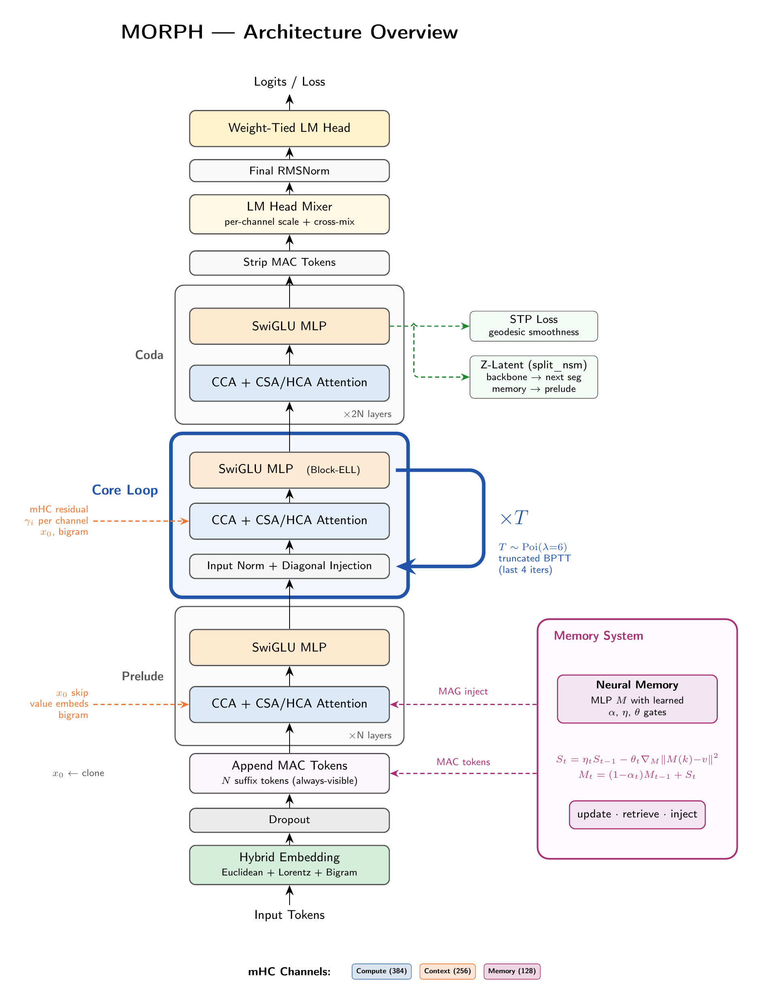
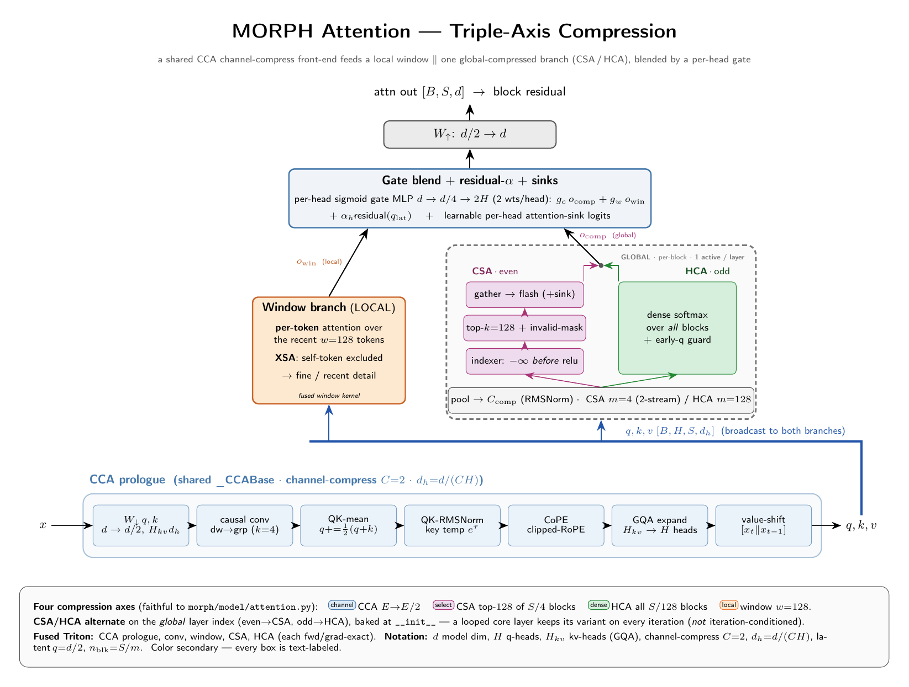
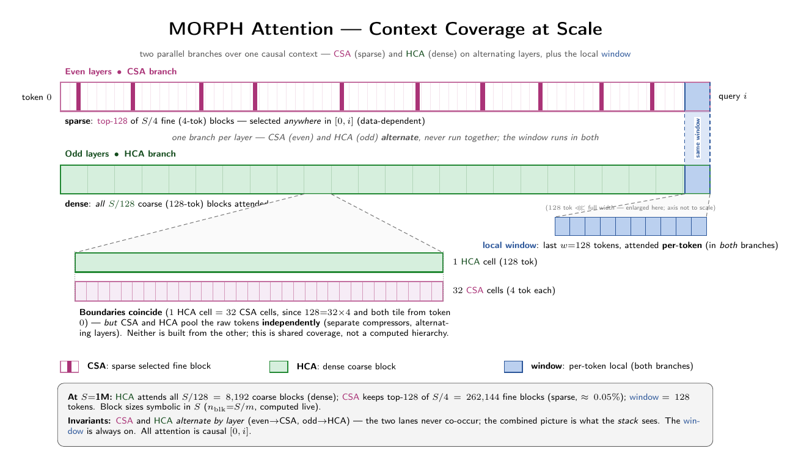
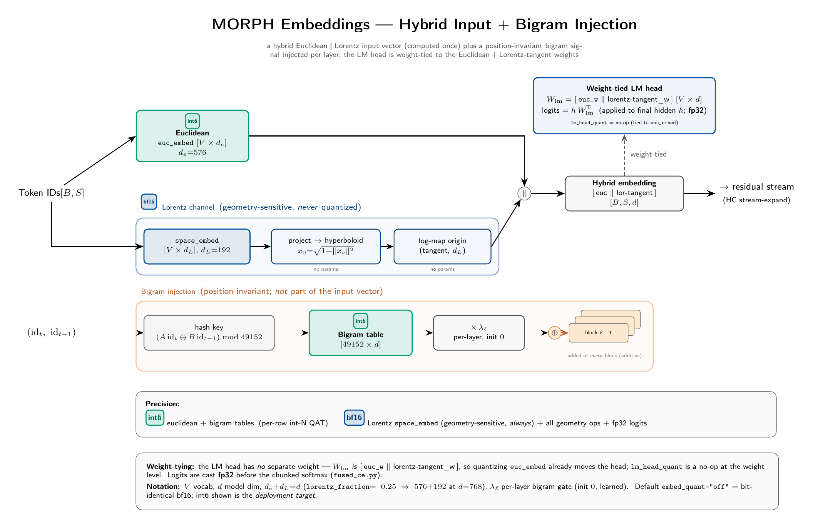
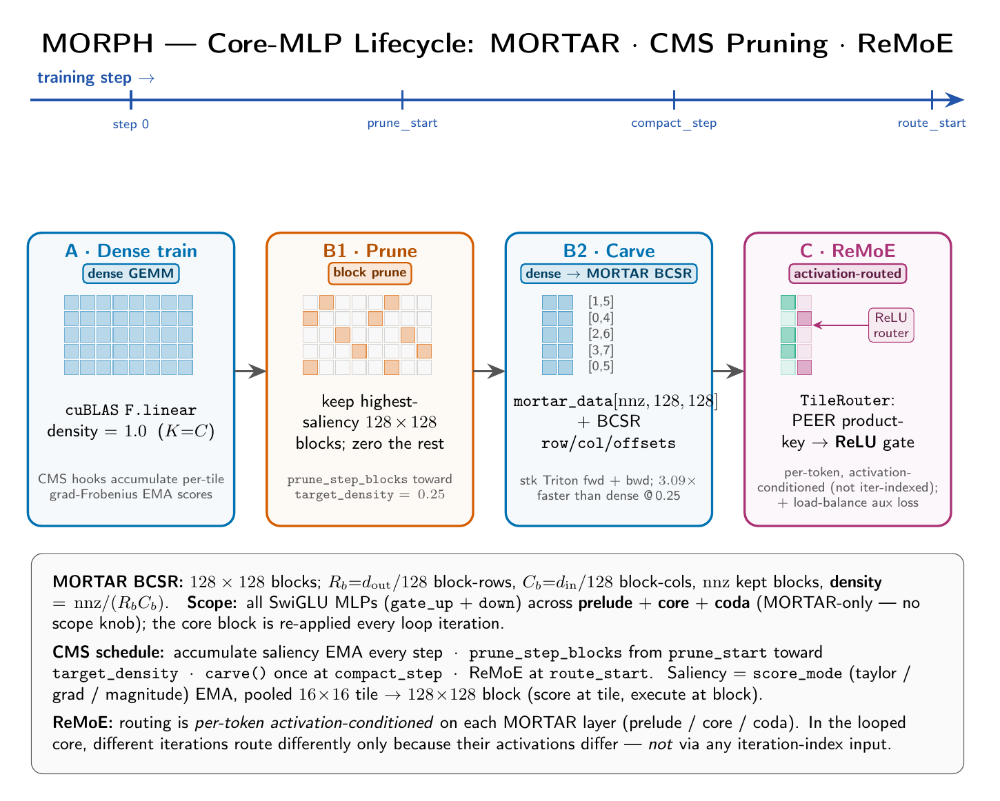

# MORPH

**MORPH Orchestrates Recursive Pruned Hierarchies**

MORPH is a looped, pruned transformer research model. It gets depth by reusing a small Parcae-style core, stabilizes that repeated execution with Cayley Hyper-Connections, and turns the MLP backbone into a carved MORTAR sparse runtime after training-time topology pruning.

Current MORPH is no longer the older TitanMAC line. Gradient neural memory, MAC tokens, LeJEPA z-latents, and the legacy 16x16 Block-ELL backend were removed. The active stack is Cayley HC, CCA+CSA/HCA attention, optional GLA retention, hybrid embeddings, STP regularization, CMS-to-MORTAR pruning, hidden-neuron ReMoE routing, and deploy QAT.

## Architecture Overview

<p align="center">
  
</p>

The canonical local config is `3 + 6xT + 3` at `d_model=768`, `d_ff=2048`, and sequence length 4096. The cloud target is `4 + 8xT + 4` at `d_model=2048`; `scale30b.yaml` is a systems/inference format test at `4 + 35xT + 4`, `d_model=8192`.

Data flows through:

1. **Hybrid embeddings**: Euclidean + Lorentz token channels with a learned hash-bigram signal injected through the body.
2. **Prelude**: non-looped blocks that establish the initial representation.
3. **Core loop**: six shared blocks executed with Poisson depth sampling (`mean_depth=6`, `max_depth=8`) and truncated BPTT over the last four grad iterations.
4. **Coda**: non-looped refinement before the final norm, LM head mixer, tied output head, and STP loss.

The loop boundary uses `DiagonalInjection` on the context channel slice only, with spectral radius constrained below 1. That gives the repeated core a stable iteration-axis drive without reintroducing the removed neural-memory stack.

## MORPH Block

<p align="center">
  
</p>

Each block has attention and MLP sublayers wrapped by the same residual carrier:

- **Residual carrier**: `residual_mode=hc_cayley` is the deploy default. Hidden state is expanded to four parallel streams `[B,S,4,C]`; a row-stochastic read map feeds each sublayer, then an orthogonal Cayley mixer preserves carrier norm as the loop repeats.
- **Attention**: `MORPHAttention` bakes in CCA channel compression, a local window, alternating CSA/HCA global context, GQA, CoPE clipped RoPE, residual attention, QK norm, and causal convolution.
- **GLA retention**: when enabled, layer index 1 in each section adds a gated linear-attention branch in parallel with attention. In the core, `retention_carry=true` carries the GLA state across loop iterations.
- **MLP**: every prelude, core, and coda MLP uses `_SwiGLUMortar`, backed by `MortarLinear`. There is no production dense-MLP fallback.

MRR is now a legacy ablation path rather than the default residual mechanism. The channel slices `[384, 256, 128]` still matter under HC for injection targets and final mixing, but they are not the deployed residual dynamics.

## Attention And Context

<p align="center">
  
</p>

MORPH uses a triple-axis attention design:

- **CCA** compresses the channel dimension before attention and applies the shared prologue features.
- **Local window attention** keeps a dense neighborhood (`window_size=128` locally) with XSA-style self-token exclusion.
- **CSA** runs on even layers, pooling by `csa_compress_ratio=4` and selecting `top_k=128` sparse global blocks.
- **HCA** runs on odd layers, pooling aggressively (`hca_compress_ratio=128`) and attending densely over the compressed stream.

<p align="center">
  
</p>

This alternation gives both fine sparse retrieval and broad dense compressed coverage while keeping the full attention path compatible with fused Triton kernels when `model.use_kernels=true`.

## Embeddings And Prediction

<p align="center">
  
</p>

`MORPHEmbedding` combines Euclidean token embeddings with a Lorentz channel (`lorentz_fraction=0.25`) and a hash-bigram table (`bigram_hash_vocab=49152`). Bigram injections have learned per-layer scales initialized at zero, so the model starts from the unigram embedding path and learns when to use the extra signal.

The final representation is mean-reduced from HC streams, passed through the LM head mixer, and evaluated with tied output weights. `STPLoss` adds zero-parameter, multi-scale geodesic smoothness over hidden-state trajectories during pretraining:

```text
loss = cross_entropy + stp_lambda * stp_loss
```

The default `stp_lambda` is `0.02` and `stp_tau` is `64`.

## Retention Memory

<p align="center">
  
</p>

The GLA branch is MORPH's current recurrent-memory experiment. It has one recurrence over sequence positions and, in the looped core, an optional second recurrence over loop iterations. The branch is a gated sum beside attention, not a replacement for attention and not the removed Titans neural memory.

## Sparsity, MORTAR, And Routing

<p align="center">
  
</p>

The sparse backend is MORTAR only:

1. **Dense masked training**: `MortarLinear` behaves like a dense linear layer while `CMSBlockLinear` accumulates saliency.
2. **CMS pruning**: `PruningSchedule` calls `prune_step_blocks` toward `target_density=0.25`.
3. **Carve**: `carve()` packs surviving 128x128 execution blocks into BCSR data for the vendored `morph/sparse/stk` Triton backend.
4. **ReMoE routing**: `_SwiGLUMortar` enables `TileRouter`, which gates post-SiLU hidden neurons over contiguous `d_ff` clusters.

The current `base.yaml` schedule is:

| Event | Default |
| --- | --- |
| Start pruning | `training.prune_start=3000` |
| Prune interval | `training.prune_interval=167` |
| Target density | `training.target_density=0.25` |
| Carve to MORTAR | `training.compact_step=29000` |
| Enable routing | `routing.route_start=30000` |
| Routing scope | `routing.route_scope=all` |

Routing is integrated, not pending. It is a quality and load-balancing mechanism: it applies soft ReLU gates to the hidden-neuron bank, while the carved MORTAR GEMM still supplies the sparse execution path. `routing.aux_detach_input=true` keeps the load-balance auxiliary gradient out of the looped carrier.

## Deployable Stack

<p align="center">
  
</p>

`morph/configs/base.yaml` now represents the validated deploy-oriented default rather than a dense bf16 isolation run:

- **Ternary QAT** is on for the backbone (`training.ternary=true`, `ternary_scope=backbone`).
- **Embedding QAT** uses per-row int6 for Euclidean and bigram embedding rows (`training.embed_quant="int6"`); Lorentz remains bf16.
- **Attention projection quantization** is off by default (`training.attn_proj_quant="off"`), with int8 left as an opt-in validation arm.
- **8-bit AdamW** is on when the training extra dependencies are installed (`training.adam8bit=true`).
- **KV cache quantization** is inference-only PTQ, implemented separately from the training forward path.

For dense curriculum work, use `pretrain_curriculum.yaml`, which deliberately disables pruning, routing, TST, ternary QAT, int6 embeddings, and 8-bit AdamW to isolate the context-length curriculum.

## Token Superposition Training

The default training recipe includes Token Superposition Training (TST):

| Setting | Default |
| --- | --- |
| Superposed tokens per position | `training.tst_bag_size=6` |
| Superposition fraction | `training.tst_ratio=0.3` |
| Recovery fraction | `0.7` |

Evaluation and generation use normal next-token prediction (`bag_size=0`). In the 100k-step base run, pruning and carving happen inside the first 30k-step superposition window; routing begins at the superposition-to-recovery boundary.

## Configs

| Config | Purpose |
| --- | --- |
| `base.yaml` | Canonical local default: HC Cayley, GLA, MORTAR schedule, ReMoE, TST, ternary backbone, int6 embeddings, 8-bit AdamW. |
| `cloud.yaml` | Larger `4 + 8xT + 4`, `d_model=2048`, sequence length 8192 target. |
| `pretrain_curriculum.yaml` | Dense bf16 curriculum phase with sparse/quant/routing/TST disabled. |
| `pretrain_curriculum_smoke.yaml` | Twelve-step transition smoke for the curriculum loader and stage changes. |
| `scale30b.yaml` | 30B-format systems/inference test config. |

## Quick Start

```bash
# Install the package
pip install -e .

# Add training extras, currently bitsandbytes for 8-bit AdamW
pip install -e ".[train]"

# Train with the canonical local config
python -m morph.training.train

# Train with Hydra overrides
python -m morph.training.train training.steps=50000 training.batch_size=4

# Run the dense curriculum config
python -m morph.training.train --config-name pretrain_curriculum
```

Training logs the resolved Hydra config to [Weights & Biases](https://wandb.ai) when enabled.

## Project Structure

```text
morph/
  model/
    transformer.py          # MORPHTransformer, Parcae loop, HC carrier, MLP routing host
    attention.py            # CCA + local window + CSA/HCA attention
    embeddings.py           # Euclidean + Lorentz + hash-bigram embeddings
    hyper_connections.py    # HyperConnection residual implementation
    mhc.py                  # MRR legacy path and MORPHBlock wiring
    sparsity.py             # MortarLinear wrapper
    routing.py              # TileRouter and routing stats/aux collection
    prediction.py           # STP loss
    ternary_qat.py          # Ternary forward-STE QAT
    embed_quant.py          # int8/int6 embedding QAT
    kv_quant.py             # inference KV cache quantization
    packed_ternary_infer.py # packed deploy inference helpers
    titans_core/            # CMS block-sparse scoring and topology logic, not neural memory
  kernels/
    triton/                 # fused attention, HC, GLA, decode, CE/support kernels
  sparse/
    stk/                    # vendored BCSR sparse execution backend
  training/
    train.py                # Hydra training entry point
    pruning.py              # prune -> carve -> route coordinator
    optimizer.py            # AdamW, 8-bit AdamW, ternary shadow optimizer support
    curriculum_data.py      # pretokenized multi-source curriculum loader
  configs/                  # Hydra configs
docs/
  figures/                  # TikZ sources for regenerated architecture figures
  references.md             # citation map and paper notes
```

## Figures

Architecture figures are maintained from the TikZ sources in `docs/figures/*.tex`. Regenerate them from that directory with `pdflatex` when updating diagrams, then keep the README image paths in sync with the generated filenames.

## References

MORPH draws on Parcae looped transformers, Hyper-Connections, CCA, CSA/HCA, XSA, CoPE, GLA-style retention, CMS/MORTAR sparse execution, ReMoE/PEER routing, Token Superposition Training, STP, and deploy-oriented quantization work. See `docs/references.md` and `docs/references/` for the paper map and local notes.

## License

Research code. See repository for terms.
