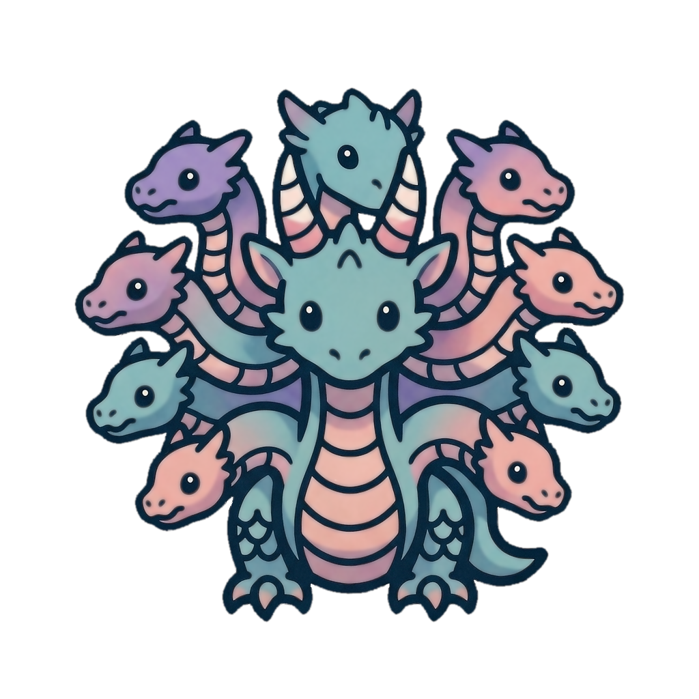
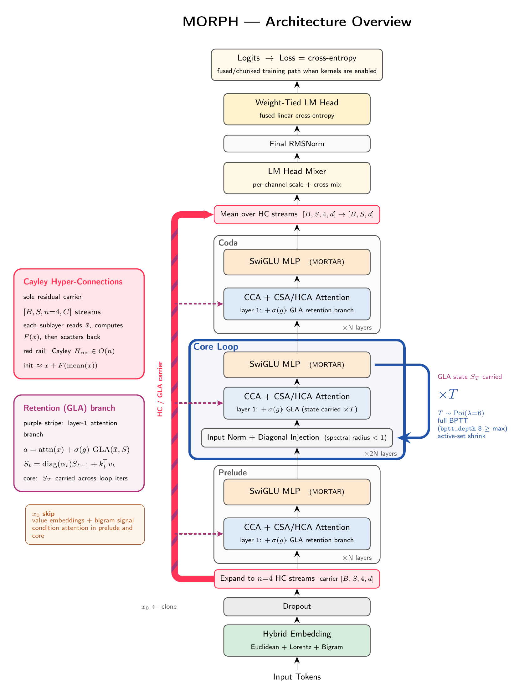
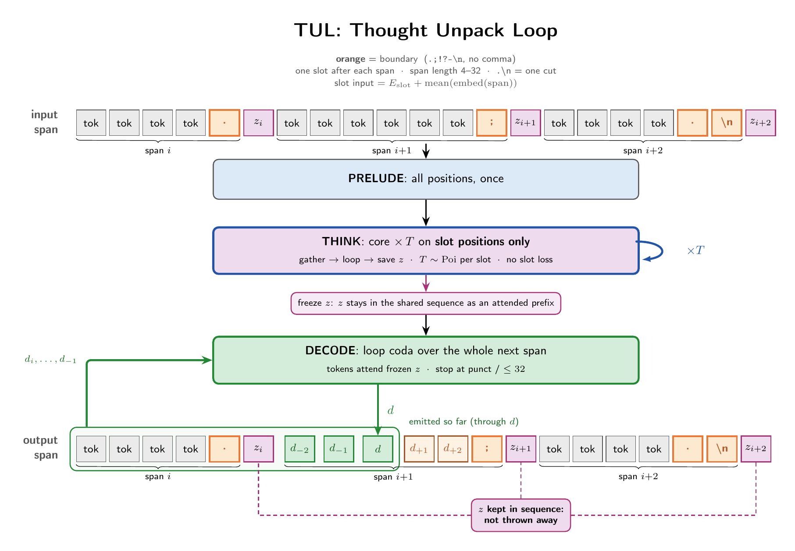
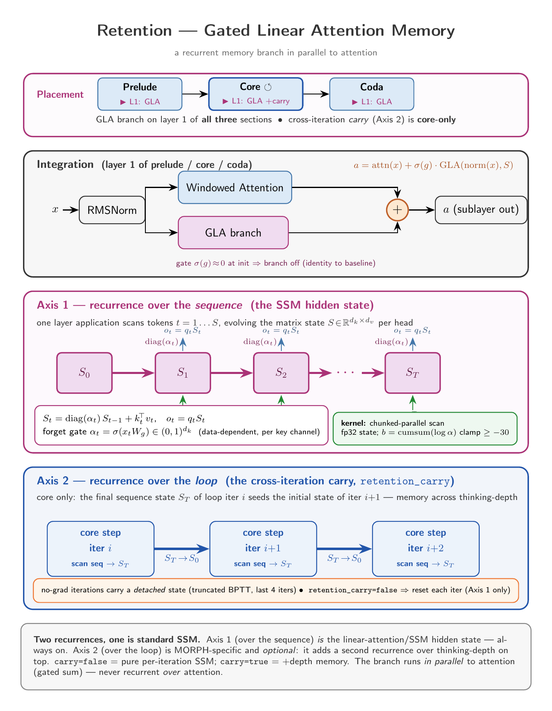
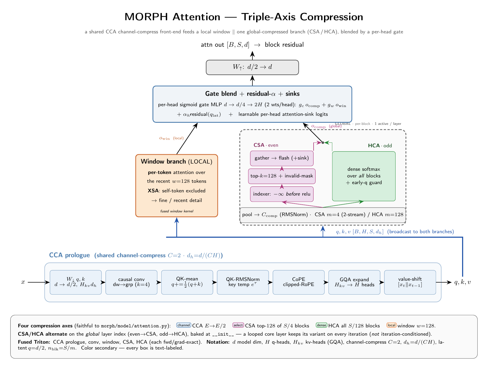
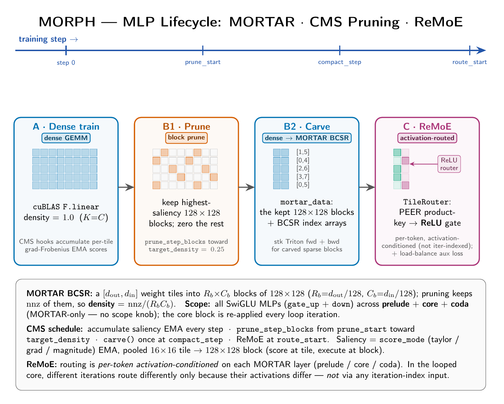

<p align="center">
  
</p>
<h1 style="text-align: center;">
MORPH
</h1>

**MORPH** is a PyTorch research model for **looped transformer** training and sparse deployment. The model reuses a small Parcae-style core for variable depth, stabilizes the repeated core with <a href="docs/references/residual-streams/2602.18308.md">Cayley Hyper-Connection</a>, and trains the MLP stack while pruning low impact weights down to as little as 25% total density before carving it into the MORTAR BCSR runtime. Enabling less than 1% ppl regression and improved memory footprint and training throughput over full density. All while natively quantized trained.

To further improve per bit intelligence and memory foot print for research, it utilizes extensive linear attention methods to enable a lower memory foot print at long contexts. Both GLA and Deepseek CSA/HCA are used, with a convolutional based compression of the kv.

Extensive ablations have ran through dozens of [papers](docs/references.md) and techniques to carve out the MORPH Architecture. It is the goal of the MORPH project to provide a true open source architecture that stays at the bleeding edge of research.

---

The PyTorch path is the implementation target. The JAX/Flax mirror under `morph/jax/` is maintained as a converter target and currently lags the PyTorch architecture.

<p align="center">
  
</p>
<p align="center"><em>Architecture overview — Parcae-style prelude / core loop / coda on a <a href="docs/references/residual-streams/2602.18308.md">Cayley Hyper-Connection</a> carrier, with a gated GLA retention branch on layer 1.</em></p>

## TUL: Thought Unpack Loop (merged, OFF by default)

TUL loops the Parcae core over one **thought slot per span** (punctuation-bounded) instead
of over every token, and decodes tokens with the slot's looped state visible as an attended
prefix position. Tokens run prelude → coda only. Specification, provenance and planned
ablations: [docs/tul-spec.md](docs/tul-spec.md); paper map: [docs/references.md](docs/references.md) §13;
measured arms: [lab/tul/arms-result.md](lab/tul/arms-result.md).

`base.yaml` ships `tul.activate_at: never`, which constructs no TUL parameters, so the
default recipe is bit-identical to plain MORPH and the main line's behaviour is unchanged.

**Results of TUL:** Over the same 20k steps the TUL arm beat the dense
baseline by 0.056 nats of `val/ce_tokens` (slightly outside noise) while running 177 minutes against 278 — a 1.6x
wall-clock win at slightly better loss. 

**TUL For Dummies:** 
- After the core loop save the hidden state, lets call z1.
- Use a frozen z1 to decode a span. A span goes to the next punctuation mark, or 32 tokens max.
- z1 kept in the sequence

So the core loop is forced to contain the full semantic thought and amortize the loop cost over many tokens. As opposed to looping many times per token.

This is based on a series of experiments run on
[Coconut](docs/references/tul-latent-emission/2412.06769.md),
[AGCLR](docs/references/tul-latent-emission/2606.07720.md), and
[Quiet-STaR](docs/references/tul-latent-emission/2403.09629.md)
(paper map: [docs/references.md](docs/references.md) §13).

<p align="center">
  
</p>
<p align="center"><em>TUL — loop once per thought, freeze <code>z</code> in the sequence, amortize decode over the next span.</em></p>

## Current Architecture

The default local model is defined in `morph/configs/base.yaml`: `3 + 6xT + 3` blocks, `d_model=768`, `d_ff=2048`, sequence length 4096, Poisson loop depth with mean 6 and max 8, and truncated BPTT over the last four core iterations. This is used for small scale testing and ablation. This fits comfortably on a 5090 at batch 4, and should fit on a 4090 if allocations do not fragment too much. Smaller sequence lengths can increase batch for these scales. 4k is selected to stress test during A/B ablation.

The cloud target is `4 + 8xT + 4` at `d_model=2048`. Roughly 1B parameters.

The active stack is:

- **Looped transformer body:** prelude blocks, a shared core loop, and coda blocks. Parcae style.
- **Cayley Hyper-Connections:** four residual carrier streams across the network, reduced before the output head.
- **CCA + CSA/HCA attention:** Compressed Convolutional Attention with local window attention plus alternating sparse and dense compressed global context. Providing sub-quadratic attention a la Deepseek, with further compression on the KV cache using CCA.
- **GLA retention:** a gated branch beside attention on configured section-local layers, with optional carry across core-loop iterations. Chosen over interleaving full attention blocks. TODO: RAVEN attention applied to GLA.
- **Hybrid embeddings:** Euclidean token embeddings, a hyperbolic Lorentz channel, and a learned hash-bigram signal injected through the body.
- **MORTAR sparse MLP path:** MORTAR provides control over 16x16 groups of perceptrons to make tracking importance tractable as an EMA for pruning (don't need a matrix of equal size as the weights). It utilizes the MegaBlocks kernel to realize the performance benefits post carving. The 16x16 sizing is GPU tile friendly for the MegaBlocks kernel to compact into something that realizes the computational savings.
- **ReMoE routing:** whole-body hidden-neuron routing after carve. Enables per token routing selection of 16x16 MORTAR tiles.
- **Deploy QAT:** ternary backbone weights, int6 Euclidean/bigram embeddings, and 8-bit AdEMAMix optimizer state by default. Lorentz embeddings must stay in bf16.
- **Triton Kernels:** Extensive Triton kernels are provided.

<p align="center">
  
</p>
<p align="center"><em>Retention — GLA branch on layer 1 of prelude / core / coda; sequence-axis SSM state always on, cross-iteration carry core-only and optional.</em></p>

<p align="center">
  
</p>
<p align="center"><em>Attention — CCA channel compress, then local window plus alternating CSA (even) / HCA (odd) global-compressed branches, gated blend into the block residual.</em></p>

docs/references for attributions to prior art.


## Training Recipe

`morph/configs/base.yaml` is the source of truth for the current local training recipe. The default run is a 100k-step local training schedule with flat `1e-4` learning rate, CMS pruning, MORTAR carve, ReMoE routing, Token Superposition Training, ternary backbone QAT, int6 embedding QAT, and 8-bit AdEMAMix optimizer based on bits and bytes implementation. This is a clean ablation surface for A/B testing.

<p align="center">
  
</p>
<p align="center"><em>MLP lifecycle — dense train → CMS prune to ~25% density → carve to MORTAR BCSR → whole-body ReMoE routing.</em></p>

High-level schedule:

| Phase | Config keys |
| --- | --- |
| Dense masked training | `training.prune_start`, `training.prune_interval` |
| CMS pruning | `training.target_density`, `training.cms_score_mode` |
| MORTAR carve | `training.compact_step` |
| ReMoE routing | `routing.route_start`, `routing.route_scope` |
| Token Superposition Training | `training.tst_bag_size`, `training.tst_ratio` |

Evaluation and generation use normal next-token prediction. TST is a training-only data-efficiency phase.

For dense curriculum work, use `pretrain_curriculum.yaml`. It deliberately disables sparse carve/routing, TST, ternary QAT, and int6 embedding QAT, so curriculum behavior can be isolated. To see if these optimizations are causing issues with an A/B.

AdEMAMix was partially based on Bits and Bytes implementation. AdEMA can have its memory foot print dramatically reduced by keeping beta-1 at 0, and not holding it in a full tensor. BnB maintains it as a full tensor even at 0.

## Quick Start

```bash
pip install -e .
pip install -e ".[train]"

python -m morph.training.train
python -m morph.training.train training.steps=50000 training.batch_size=4
python -m morph.training.train --config-name pretrain_curriculum
```

Training logs the resolved Hydra config to Weights & Biases when W&B is enabled.

## Repository Map

```text
.agents/notes/              # Public decision records (see AGENTS.md)
lab/                        # Spikes + campaign finals (TUL arms, runtime-invariants)
tests/
scripts/                    # verify_template, pretok, probes
morph/
  model/
    transformer.py          # MORPHTransformer, looped core, TUL forward paths
    tul.py / tul_layout.py  # Thought Unpack Loop (slots, boundary packer)
    attention.py            # CCA + CSA/HCA + XSA + ResAttn + CoPE
    embeddings.py           # Euclidean + Lorentz + hash-bigram
    hyper_connections.py    # HyperConnectionResidual (Cayley n=4)
    mhc.py                  # MORPHBlock wiring (mrr_* attrs = HC, legacy names)
    gla.py                  # GLA retention branch
    sparsity.py             # MortarLinear (dense → MORTAR BCSR)
    layers/                 # CMSBlockLinear, topology scorer, norms
    routing.py              # TileRouter (whole-body ReMoE)
    ternary_qat.py          # Ternary forward-STE QAT
    embed_quant.py          # int8/int6 embedding QAT
    attn_proj_quant.py      # attention-projection QAT (opt-in)
    fused_ce.py / kv_quant.py / fp8_scope.py
  kernels/triton/           # fused attention, HC, GLA, decode, router, CE
  sparse/stk/               # vendored MegaBlocks STK (MORTAR BCSR exec)
  training/
    train.py                # Hydra entry point
    pruning.py              # dense → prune → carve → route
    tul_setup.py            # resolve tul: Hydra block
    optimizer.py / ademamix_b1zero.py
    data.py / curriculum*.py / sft*.py
  inference/                # generation, KV cache, TUL generate
  posttrain/                # deploy artifacts, masks, validation
  jax/                      # JAX/Flax mirror (lags PyTorch)
  interop/                  # PT ↔ JAX checkpoint conversion
  configs/                  # Hydra YAML (base.yaml is recipe SoT)
docs/
  MANIFEST.md               # docs navigator
  mortar-bcsr.md            # MORTAR BCSR format readout
  ablation-ledger.md        # accepted / rejected / deferred
  tul-spec.md               # Thought Unpack Loop contract
  olympiad-interop.md       # PT ↔ JAX / Olympiad notes
  figures/                  # PNG previews + topic-grouped TikZ sources
  references.md             # paper map + MORPH usage notes
  references/               # local paper archive (see references/MANIFEST.md)
ignore/                     # private scratch (wandb, Hydra outputs) — not public
```

## Figures And References

The figures above are the README highlights. The full set lives under `docs/figures/`
(PNG previews at the top; TikZ/PDF sources topic-grouped underneath). Start with
[`docs/MANIFEST.md`](docs/MANIFEST.md). Regeneration: [`docs/figures/MANIFEST.md`](docs/figures/MANIFEST.md).

Paper map: [`docs/references.md`](docs/references.md); local copies indexed by
[`docs/references/MANIFEST.md`](docs/references/MANIFEST.md). MORTAR format:
[`docs/mortar-bcsr.md`](docs/mortar-bcsr.md). Ablations: [`docs/ablation-ledger.md`](docs/ablation-ledger.md).
Runtime invariants: [`lab/runtime-invariants.md`](lab/runtime-invariants.md).
Known-good runs: [`.agents/notes/implemented/process/2026-07-03-known-good-runs.md`](.agents/notes/implemented/process/2026-07-03-known-good-runs.md).
Campaign logs and gate scripts stay under `ignore/` / `lab/`.

## Contributing

MORPH uses a stable snapshot plus research integration model. See `CONTRIBUTING.md` for branch policy, evidence expectations, and release rules.

## License

Apache License 2.0. See `LICENSE`.

Vendored third-party components keep their own license notices, including `morph/sparse/stk/LICENSE`.
