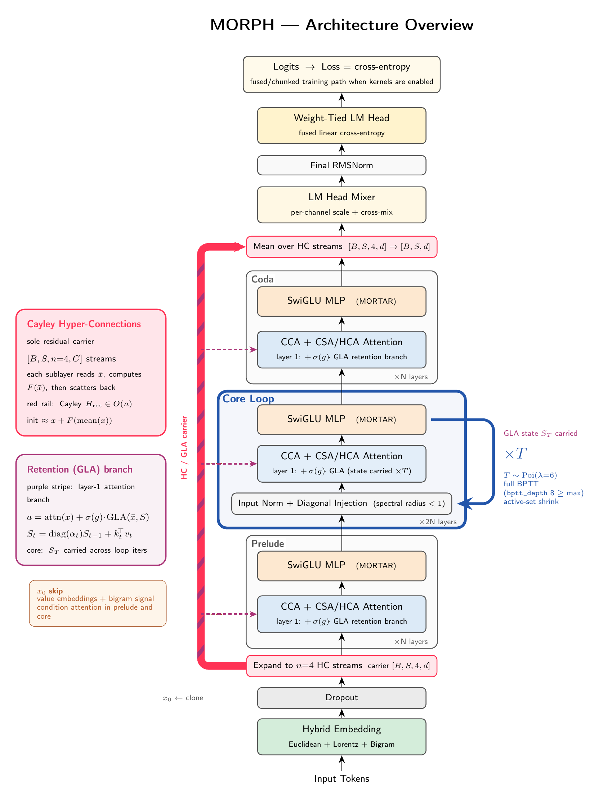
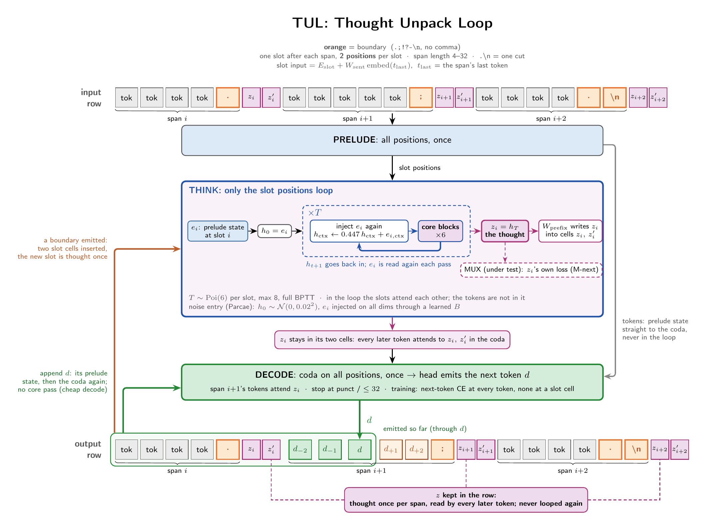
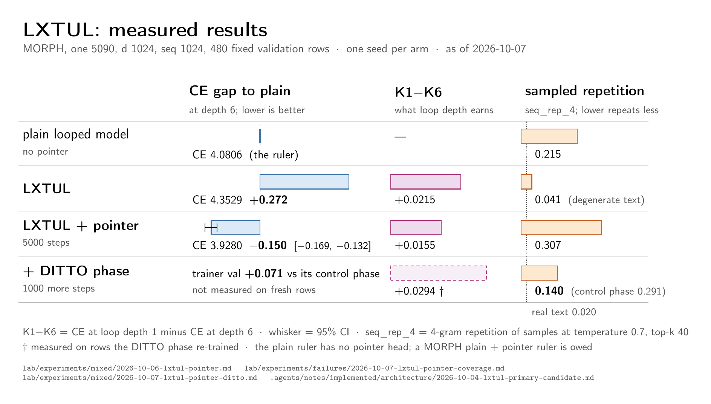
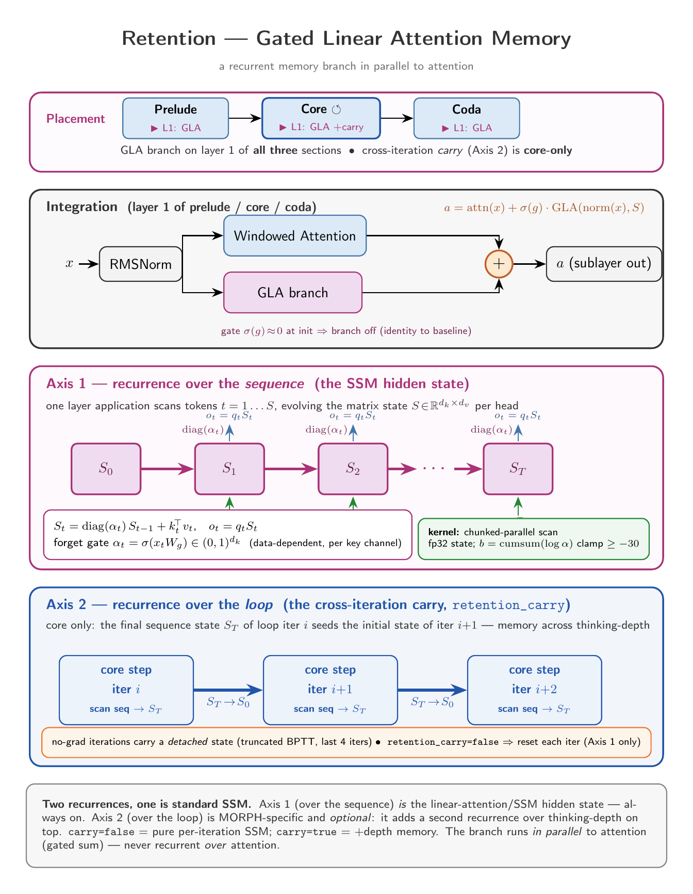
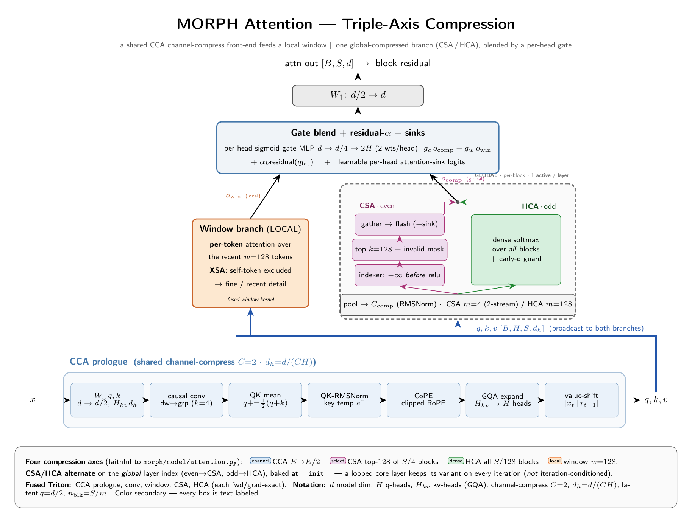
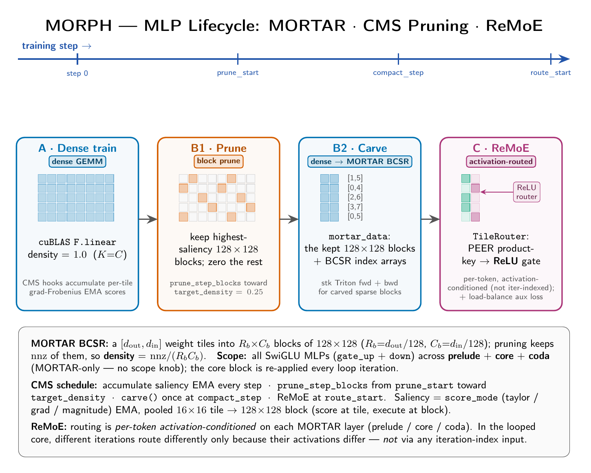

<p align="center">
  
</p>
<p align="center">
<h1 style="text-align: center;">
MORPH 0.1
</h1>
</p>

**MORPH** is a research Language Model for **looped transformer** training and sparse deployment. The model reuses a small Parcae-style core for variable depth, stabilizes the repeated core with [Cayley Hyper-Connection](docs/references/residual-streams/jpmhc/jpmhc.md), and trains the MLP stack while pruning low impact weights down to as little as 25% total density before carving it into the MORTAR BCSR runtime. Enabling less than 1% ppl regression and improved memory footprint and training throughput over full density. All while natively quantized trained.

To improve memory foot print for research, it utilizes extensive linear attention methods to enable a lower memory foot print at long contexts. Both [GLA](docs/references/memory/gla/gla.md) and [DeepSeek CSA/HCA](docs/references/attention/deepseek-v4/deepseek-v4.md) are used, with a convolutional based compression of the kv ([CCA](docs/references/attention/cca/cca.md)).

Extensive ablations have ran through dozens of [papers](docs/references.md) and techniques to carve out the MORPH Architecture. It is the goal of the MORPH project to provide a true open source architecture that stays at the bleeding edge of research.

---

The PyTorch path is the implementation target. The JAX/Flax mirror under `morph/jax/` is maintained as a converter target and currently lags the PyTorch architecture.

<p align="center">
  
</p>
<p align="center"><em>Architecture overview: Parcae-style prelude / core loop / coda on a <a href="docs/references/residual-streams/jpmhc/jpmhc.md">Cayley Hyper-Connection</a> carrier, with a gated <a href="docs/references/memory/gla/gla.md">GLA</a> retention branch on layer 1.</em></p>

## TUL: Thought Unpack Loop (LXTUL)


<p align="center">
  
</p>
<p align="center"><em>LXTUL, the latent-selected slot loop: only the slots loop, a router keeps one of 4 cells after each pass, and only the winner reaches the coda. Between spans, the loop is the only path. The full drawing, with the train-only heads, the pointer head and the DITTO phase, is <a href="docs/figures/architecture/tul_mechanism_detailed.tex">tul_mechanism_detailed.tex</a>.</em></p>

<p align="center">
  
</p>
<p align="center"><em>Measured results of the recipe (one seed per arm, 2026-10-07): the pointer head moves LXTUL from 0.272 behind the plain looped model to 0.150 ahead, and the DITTO phase halves its sampled repetition. Numbers and caveats are in the table below.</em></p>


TUL thinks once per span instead of once per token. The text is cut into spans at
punctuation. Each span gets one thought slot, and only the slots run the looped core. The
tokens of the next span are decoded with the slot's looped state in view.

The current TUL is **LXTUL**, the latent-selected slot loop. The recipe has two stages:
[`morph/configs/lxtul_pointer.yaml`](morph/configs/lxtul_pointer.yaml) for 5000 steps, then
the 1000-step DITTO phase [`morph/configs/lxtul_pointer_ditto.yaml`](morph/configs/lxtul_pointer_ditto.yaml).
Both compose the LXTUL base [`morph/configs/lxtul.yaml`](morph/configs/lxtul.yaml).
Decision record: [the 2026-10-07 winner note](.agents/notes/implemented/architecture/2026-10-07-lxtul-pointer-ditto-winner.md).
Every attempt to make the loop contribute, with its numbers:
[docs/tul-loop-contribution-history.md](docs/tul-loop-contribution-history.md).
Paper map: [docs/references.md](docs/references.md) §13. The v0.1 spec is history:
[.agents/specs/tul-spec.md](.agents/specs/tul-spec.md).

`base.yaml` does not run LXTUL. It still ships the older paid loop
(`tul.tokens_through_core: true`: tokens and slots all run the core). The paid loop is
history; its record is
[.agents/notes/rejected/architecture/2026-09-02-tul-paid-loop-recipe.md](.agents/notes/rejected/architecture/2026-09-02-tul-paid-loop-recipe.md).

**Results of TUL** (MORPH, one 5090, d 1024, seq 1024, 480 fixed validation rows; ONE
seed per arm):

| model | CE at depth 6 | gap to plain | K1-K6 | sampled seq_rep_4 |
| --- | --- | --- | --- | --- |
| plain looped model (no pointer) | 4.0806 | 0 | | 0.215 |
| LXTUL | 4.3529 | +0.272 | +0.0215 | 0.041 (degenerate text) |
| LXTUL + pointer, 5k steps | 3.9280 | -0.150 [-0.169, -0.132] | +0.0155 | 0.307 |
| + DITTO phase, 1000 steps | +0.071 trainer val vs its control phase | not measured on fresh rows | +0.0294 (on re-trained rows) | 0.140 (control phase 0.291) |

K1-K6 is the CE at loop depth 1 minus the CE at depth 6: what loop depth earns.
"Sampled seq_rep_4" is 4-gram repetition at temperature 0.7, top-k 40 (real text: 0.020).
Sources: [pointer pair](lab/experiments/mixed/2026-10-06-lxtul-pointer.md),
[coverage phase](lab/experiments/failures/2026-10-07-lxtul-pointer-coverage.md),
[DITTO phase](lab/experiments/mixed/2026-10-07-lxtul-pointer-ditto.md),
[LXTUL base](.agents/notes/implemented/architecture/2026-10-04-lxtul-primary-candidate.md).

What these numbers do not show yet:

- One seed per arm. The two LXTUL base seeds differ by 0.009 at depth 6.
- The plain ruler has no pointer head. A MORPH plain + pointer run is owed. On the Parcae
  testbed, plain + pointer led strict LXTUL + pointer by 0.045 nats.
- The loop's earning is small: K1-K6 is 0.0155 nats with the pointer, 0.0215 / 0.0172
  without it (two seeds). With the head forced off, CE is 4.41, 0.05 worse than an LXTUL
  that never had the head.
- DITTO halves sampled repetition and lands below plain, but costs +0.071 nats of clean
  validation CE against its control phase. Its samples show junk subword runs that are not
  yet counted.
- Training speed is 11.8k tok/s. The Parcae testbed runs LXTUL + pointer at 22.2k tok/s on
  the same rows. The work per step is equal; the MORPH step is host-serial and launch-bound
  ([speed filing](lab/experiments/mixed/2026-10-07-morph-vs-parcae-speed.md)). A faster
  training step is in progress on a branch.
- Decode speed is not measured. The KV-cached generators refuse the fan and the pointer
  head, so only the eager recompute generator runs this model.

**TUL For Dummies:**
- Cut the text into spans at punctuation (4 to 32 tokens). After each span, the row gets
  one slot with 4 cells.
- The prelude reads each span once. Tokens never enter the loop.
- The loop runs the shared core blocks over every slot's 4 cells, T passes (T is drawn
  per slot, mean 6, max 8).
- After each pass a small router picks one cell, and all 4 cells restart from it.
- After the last pass the winner alone is written into the slot.
- The coda decodes the tokens. A token sees its own span and the winners of all earlier
  slots. Inside the model, that is the only path from one span to the next.
- An output-only pointer head lets a token copy a word that appeared earlier. It reads
  final states and writes nothing back.
- A short DITTO phase teaches the model that each repeat of a phrase must be less likely
  than the one before.

So the core loop has to hold the span's thought, and its cost is spread over the span's
tokens instead of being paid on every token.

This is based on a series of experiments run on
[Coconut](docs/references/tul-latent-emission/coconut/coconut.md),
[AGCLR](docs/references/tul-latent-emission/agclr/agclr.md), and
[Quiet-STaR](docs/references/tul-latent-emission/quiet-star/quiet-star.md)
(paper map: [docs/references.md](docs/references.md) §13).

---

From experimentation with looping and halting, halting mechanisms don't give a real win over no halting.
HRM dropped [ACT](docs/references/tul-latent-emission/act/act.md) for their LLM for this reason. The likely cause for this is what inspired TUL.

[Future Lens](docs/references/tul-latent-emission/future-lens/future-lens.md) shows us that the middle layers contain whole semantic thoughts, lets call ST. We can decode many tokens from it successfully.
Anthropic's [J-lens / J-space](docs/references/tul-latent-emission/j-space/j-space.md) is the same picture from the other direction: mid-depth verbalizable concepts held for future report, not just the next token.
Measurements I made while pretraining showed me that over a span of tokens (a ST or sentence) this latent barely moves.
The final hidden state moves a lot more, as it is decoding the actual token from the ST based on the position in the sequence.
The text gives state for what comes next in the sentence, and it mostly effects lower layers.

If looping more deeply gives a deeper thought. Every token in the span needs that thought to decode accurately.
Because previous methods are still doing autoregressive next token prediction, this looping must match per token in the span.
[PonderNet](docs/references/tul-latent-emission/pondernet/pondernet.md) and [ACT](docs/references/tul-latent-emission/act/act.md) ignore this and try to vary per token.
Difficulty that needs deeper thought lives at the span level and not the token level.

TUL gives a method of exploiting this, while genuinely reducing compute costs.

History: a gated version, based on Quiet-STaR, chose a variable span length k. It was built
in 2026-08 and retired on 2026-09-03 with the slot-only core
([gate spec](.agents/specs/tul-gate-spec.md)).

## Current Architecture

The default local model is defined in `morph/configs/base.yaml`: `3 + 6xT + 3` blocks, `d_model=768`, `d_ff=2048`, sequence length 4096, Poisson loop depth with mean 6 and max 8, and truncated BPTT over the last four core iterations. This is used for small scale testing and ablation. This fits comfortably on a 5090 at batch 4, and should fit on a 4090 if allocations do not fragment too much. Smaller sequence lengths can increase batch for these scales. 4k is selected to stress test during A/B ablation.

The cloud target is to prune from 3b to 1b params.

The active stack is:

- **[Looped transformer body](docs/references.md#parcae--stable-looped-transformer):** prelude blocks, a shared core loop, and coda blocks. Parcae style.
- **[Cayley Hyper-Connections](docs/references.md#jpmhc--jacobian-preserving-manifold-hyper-connections-cayley):** four residual carrier streams across the network, reduced before the output head.
- **[CCA](docs/references.md#cca--compressed-convolutional-attention) + [CSA/HCA](docs/references.md#csa--hca--compressed-sparse--heavily-compressed-attention) attention:** Compressed Convolutional Attention with local window attention plus alternating sparse and dense compressed global context. Providing sub-quadratic attention a la Deepseek, with further compression on the KV cache using CCA.
- **[GLA retention](docs/references.md#gla--gated-linear-attention-retention-branch):** a gated branch beside attention on configured section-local layers, with optional carry across core-loop iterations. Chosen over interleaving full attention blocks. TODO: [RAVEN](docs/references.md#raven--sparse-memory-routing-planned-on-gla) attention applied to GLA.
- **[Hybrid embeddings](docs/references.md#hybrid-mixed-curvature-embeddings):** Euclidean token embeddings, a [hyperbolic Lorentz](docs/references.md#lorentz--hyperbolic-embeddings) channel, and a learned hash-bigram signal injected through the body.
- **[MORTAR sparse MLP path](docs/mortar-bcsr.md)** ([MegaBlocks STK](docs/references.md#megablocks--block-sparse-gpu-kernels-stk)): MORTAR provides control over 16x16 groups of perceptrons to make tracking importance tractable as an EMA for pruning (don't need a matrix of equal size as the weights). It utilizes the MegaBlocks kernel to realize the performance benefits post carving. The 16x16 sizing is GPU tile friendly for the MegaBlocks kernel to compact into something that realizes the computational savings.
- **[ReMoE routing](docs/references.md#remoe--differentiable-moe-routing):** whole-body hidden-neuron routing after carve. Enables per token routing selection of 16x16 MORTAR tiles.
- **Deploy QAT:** [ternary](docs/references.md#ste-ternary--straight-through-estimator--bitnet-b158) backbone weights, int6 Euclidean/bigram embeddings, and 8-bit [AdEMAMix](docs/references.md#ademamix--dual-ema-adam-variant) optimizer state by default. Lorentz embeddings must stay in bf16.
- **Triton Kernels:** Extensive Triton kernels are provided (see the fused-kernel notes under [JPmHC](docs/references.md#jpmhc--jacobian-preserving-manifold-hyper-connections-cayley), [GLA](docs/references.md#gla--gated-linear-attention-retention-branch), and [MegaBlocks STK](docs/references.md#megablocks--block-sparse-gpu-kernels-stk)).

<p align="center">
  
</p>
<p align="center"><em>Retention: GLA branch on layer 1 of prelude / core / coda; sequence-axis SSM state always on, cross-iteration carry core-only and optional.</em></p>

<p align="center">
  
</p>
<p align="center"><em>Attention: CCA channel compress, then local window plus alternating CSA (even) / HCA (odd) global-compressed branches, gated blend into the block residual.</em></p>

Paper attributions: [docs/references.md](docs/references.md).


## Training Recipe

`morph/configs/base.yaml` is the source of truth for the current local training recipe. The default run is a 100k-step local training schedule with flat `1e-4` learning rate, CMS pruning, MORTAR carve, ReMoE routing, [Token Superposition Training](docs/references.md#token-superposition-training-tst), ternary backbone QAT, int6 embedding QAT, and 8-bit AdEMAMix optimizer based on bits and bytes implementation. This is a clean ablation surface for A/B testing.

<p align="center">
  
</p>
<p align="center"><em>MLP lifecycle: dense train → CMS prune to ~25% density → carve to MORTAR BCSR → whole-body ReMoE routing.</em></p>

High-level schedule:

| Phase | Config keys |
| --- | --- |
| Dense masked training | `training.prune_start`, `training.prune_interval` |
| [CMS pruning](docs/mortar-bcsr.md#cms-how-blocks-die) | `training.target_density`, `training.cms_score_mode` |
| [MORTAR carve](docs/mortar-bcsr.md#carve-what-actually-happens) | `training.compact_step` |
| [ReMoE routing](docs/references.md#remoe--differentiable-moe-routing) | `routing.route_start`, `routing.route_scope` |
| [Token Superposition Training](docs/references.md#token-superposition-training-tst) | `training.tst_bag_size`, `training.tst_ratio` |

Evaluation and generation use normal next-token prediction. TST is a training-only data-efficiency phase.

For dense curriculum work, use `pretrain_curriculum.yaml`. It deliberately disables sparse carve/routing, TST, ternary QAT, and int6 embedding QAT, so curriculum behavior can be isolated. To see if these optimizations are causing issues with an A/B.

AdEMAMix was partially based on Bits and Bytes implementation. AdEMA can have its memory foot print dramatically reduced by keeping beta-1 at 0, and not holding it in a full tensor. BnB maintains it as a full tensor even at 0.

## Quick Start

```bash
pip install -e .
pip install -e ".[train]"

python -m morph.training.train
python -m morph.training.train training.steps=50000 training.batch_size=4
python -m morph.training.train --config-name pretrain_curriculum
```

Training logs the resolved Hydra config to Weights & Biases when W&B is enabled.

## Repository Map

```text
.agents/notes/              # Public decision records (see AGENTS.md)
.agents/specs/              # TUL v0.1, TUL-gate and TUL-TG specs (history)
lab/                        # Spikes + campaign finals (TUL arms, runtime-invariants)
tests/
scripts/                    # verify_template, pretok, probes
morph/
  model/
    transformer.py          # MORPHTransformer, looped core, TUL forward paths
    tul.py / tul_layout.py  # Thought Unpack Loop (slots, register, boundary packer)
    tul_fan.py              # LXTUL fan: K cells per slot through the shared core
    tul_fan_route.py        # router, EMA-prelude target, latent head, reset to winner
    tul_spandec.py          # train-only span decoder (decodes the next span)
    tul_pointer.py          # output-only pointer / copy head (LXTUL winner)
    tul_ditto.py            # DITTO repetition loss (the 1000-step phase)
    attention.py            # CCA + CSA/HCA + XSA + ResAttn + CoPE
    embeddings.py           # Euclidean + Lorentz + hash-bigram
    hyper_connections.py    # HyperConnectionResidual (Cayley n=4)
    mhc.py                  # MORPHBlock wiring (mrr_* attrs = HC, legacy names)
    gla.py                  # GLA retention branch
    sparsity.py             # MortarLinear (dense → MORTAR BCSR)
    layers/                 # CMSBlockLinear, topology scorer, norms
    routing.py              # TileRouter (whole-body ReMoE)
    ternary_qat.py          # Ternary forward-STE QAT
    embed_quant.py          # int8/int6 embedding QAT
    attn_proj_quant.py      # attention-projection QAT (opt-in)
    fused_ce.py / kv_quant.py / fp8_scope.py
  kernels/triton/           # fused attention, HC, GLA, decode, router, CE
  sparse/stk/               # vendored MegaBlocks STK (MORTAR BCSR exec)
  training/
    train.py                # Hydra entry point
    pruning.py              # dense → prune → carve → route
    tul_setup.py            # resolve tul: Hydra block
    optimizer.py / ademamix_b1zero.py
    data.py / curriculum*.py / sft*.py
  inference/                # generation, KV cache, TUL generate
  posttrain/                # deploy artifacts, masks, validation
  jax/                      # JAX/Flax mirror (lags PyTorch)
  interop/                  # PT ↔ JAX checkpoint conversion
  configs/                  # Hydra YAML (base.yaml is recipe SoT; lxtul_pointer*.yaml = TUL)
docs/
  MANIFEST.md               # docs navigator
  mortar-bcsr.md            # CMS prune + MORTAR BCSR readout
  ablation-ledger.md        # accepted / rejected / deferred
  tul-loop-contribution-history.md  # every TUL loop-contribution attempt, with sources
  olympiad-interop.md       # PT ↔ JAX / Olympiad notes
  figures/                  # PNG previews + topic-grouped TikZ sources
  references.md             # paper map + MORPH usage notes
  references/               # local paper archive (see references/MANIFEST.md)
ignore/                     # private scratch (wandb, Hydra outputs), not public
tile-prover/                # Lean/z3 confirmations of kernel correctness to original algorithm
```

## Figures And References

The figures above are the README highlights. The full set lives under `docs/figures/`
(PNG previews at the top; TikZ/PDF sources topic-grouped underneath). Start with
[`docs/MANIFEST.md`](docs/MANIFEST.md). Regeneration: [`docs/figures/MANIFEST.md`](docs/figures/MANIFEST.md).

Paper map: [`docs/references.md`](docs/references.md); local copies indexed by
[`docs/references/MANIFEST.md`](docs/references/MANIFEST.md). MORTAR format:
[`docs/mortar-bcsr.md`](docs/mortar-bcsr.md). Ablations: [`docs/ablation-ledger.md`](docs/ablation-ledger.md).
Runtime invariants: [`lab/runtime-invariants.md`](lab/runtime-invariants.md).
Known-good runs: [`.agents/notes/implemented/process/2026-07-03-known-good-runs.md`](.agents/notes/implemented/process/2026-07-03-known-good-runs.md).
Campaign logs and gate scripts stay under `ignore/` / `lab/`.

## Contributing

MORPH uses a stable snapshot plus research integration model. See `CONTRIBUTING.md` for branch policy, evidence expectations, and release rules. 

The biggest contributions towards MORPH would be benefiting the FOSS ML
ecosystem in other ways beyond this project. Such as building and testing RL environments.
Or thoroughly tested implementations of closed research papers.
Or hard forks to test variants of MORPH that can help steer design decisions across major versions.

The number of times open implementations dramatically sped up development of MORPH was huge. 
Often times I would drop a research direction for a few days and come back to 
it to find someone had released on github a related implementation in that time frame.
A lot of these are not referenced in docs because the due dilligence wasn't there
in recreating *at least* a facsimile of the original paper. Or there were claims/behaviors in the project
that I was not seeing in my testing. Overall a lot of these projects were sloppy, and tended to poison the LLM working on MORPH.

These projects sometimes were a giant waste of time, often times they still helped catch oversights
on implementation details even when other aspects were quite poor. The dilligence needs to be higher on these projects. Try to break the mechanism.
Show where it is weak. Test it on different architectures and data. And PLEASE stop training
things that are 95% embedding matrix and trying to use that as proof of concept or verification.
Aceing CIFAR is basically noise at this point. At least try to torch.compile.

These issues are often times upstream of the implementation. If you are recreating an implementation
of a closed paper you are likely walking into a minefield of things left unsaid and under specified.
You resolve this ambiguity by trying to break it. Found an attention mechanism that sounds really good?
It shows a 110% NIAH retrieval at 20m tok seqlen? Does it work on semantic retrieval too and not just word matching? Did you perturb the mechanism to prove its actually contributing?

## License

Apache License 2.0. See `LICENSE`.

Vendored third-party components keep their own license notices, including `morph/sparse/stk/LICENSE`.


## Thanks

- **DeepSeek** CSA / HCA
- **DeepSeek** tile-prover methodology
- **Zyphra** CCA
- **UCSD / Together AI** Parcae
- **MIT / IBM Research** GLA
- **Moonshot AI (Kimi)** Residual Attention
- **Apple ML Research** XSA
- **JPMorgan Chase** JPmHC (Cayley Hyper-Connections)
- **DeepSeek** mHC (related)
- **ByteDance** Hyper-Connections (related)
- **FAIR** Lorentz embeddings
- **Stanford** hybrid / mixed-curvature embeddings
- **MIT CSAIL** Lottery Ticket Hypothesis
- **Stanford / MSR / Google** MegaBlocks STK
- **Tsinghua** ReMoE
- **FAIR** PEER
- **Microsoft Research** BitNet / STE ternary
- **Nous Research** Token Superposition Training
- **EPFL / Apple** AdEMAMix
- **BigCode / Hugging Face** StarCoder2 tokenizer
- **Google** SwiGLU
- **Bits n Bytes** AdEMAMix reference implementation

## TODO
- [RAVEN](docs/references.md#raven--sparse-memory-routing-planned-on-gla) attention on GLA.