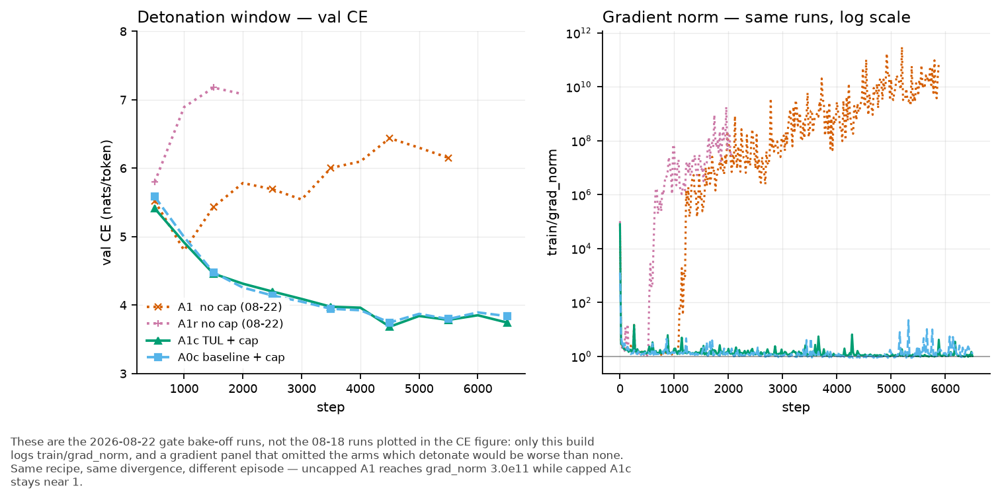

# Experiment: what makes the TUL arms diverge?

Status: failure

## Question

All three arms of the 2026-08-21 gated-TUL bake-off failed. Two of them (`tul_a1`,
`tul_a1r`) carry **no gate at all** and both aborted on the pre-existing DIV-GUARD
after a slow loss detonation. So the divergence is a property of the TUL short recipe,
not of the gate. Which mechanism drives it?

Two candidate causes, not mutually exclusive:

- **(A) Contractivity.** The core map's gain crosses 1, the looped forward amplifies it
  as `ρ^T`, and the backward explodes. `CLAUDE.md`'s iterative-map section names this as
  the working explanation for the β1=0 AdEMAMix detonations, and names `ρ(J_core)` as the
  probe. `morph/training/spectral_penalty.py` exists to control it and is OFF
  (`spectral_penalty_cap: 0.0`, `spectral_penalty_lambda: 0.0`).
- **(B) The optimizer's slow-EMA push.** `ademamix_alpha: 8.0` warms in over
  `ademamix_t_alpha: 1600` steps. Onset is near step 600, inside that horizon.

## Figure

Uncapped A1 reaches `train/grad_norm` 3.0e11 while the capped arms stay near 1 for the
whole run. Regenerate: `python scripts/plot_tul_arms.py --only divergence`.

## What is already measured (from the failed runs, not from this experiment)

- `train/grad_norm` on `tul_gate`: 1.69 @500 → 303 @600 → 9.0e4 @700 → 8.0e5 @800.
  On `tul_a1` it ends at 9.6e10 @5800. Ten orders of magnitude.
- Post-clip `gradnorm/core` = 0.9998 of the total norm; `gradnorm/coda` = 1e-10.
  The clip is one uniform rescale, so this is not "the coda has no gradient" — it is
  the core's gradient being ~1e10 larger, which annihilates every other region.
  **The prelude and the coda stop learning; only the core moves, on an exploded gradient.**
- σ_max of the core MLP linears in `tul-a1/DIVERGED_step_5900.pt`. Ternary QAT is on, so
  the forward uses the ternarized weight, NOT the shadow — both are reported because the
  first pass measured only the shadow and overstated the runaway by ~2x:

  | linear | shadow σ | **effective (ternarized) σ** |
  |---|---|---|
  | core.0.gate_up | 21.4 | **11.1** |
  | core.0.down | 13.7 | 6.6 |
  | core.1–5.gate_up | 5.0–10.2 | 2.8–5.1 |
  | core.1–5.down | 4.3–6.4 | 2.4–3.5 |

  8 of 12 core MLP linears are over the cap of 3 on the effective weight. `base.yaml`
  documents the healthy band as ~1.5 and a cap of 3 as "only fires on runaway"; the new
  `[spec]` logging reads **1.41 at init**, which confirms that calibration.
  `CoreSpectralPenalty` measures the effective weight (it calls `lin(v)`, so the STE is
  live), so the numbers this experiment logs are the effective ones.
- `tul_gate` did not reach DIV-GUARD; it OOMed at step ~1050 (23.58 GB peak + a ~6 GB
  desktop on a 31.4 GB card). Its grad norm was already 8e5, so it was detonating too.

## Method

Four arms, `tul_a1` config (gate OFF — the simplest arm that diverged), 1500 steps,
seed 0, batch 14, `eval_every=250`, `spectral_penalty_log_every=100`. Sequential, one GPU.

| arm | change vs `tul_a1` |
|---|---|
| D0 | none (control; σ logging only, which is bit-exact at λ=0) |
| D1a | `spectral_penalty_cap=3.0 spectral_penalty_lambda=0.1` |
| D1b | `spectral_penalty_cap=3.0 spectral_penalty_lambda=1.0` |
| D2 | `ademamix_alpha=0.0` (same optimizer, slow-EMA push removed) |

New instrumentation, written before the run: `spec/sigma_max`, `spec/sigma_mean`,
`spec/sigma_gate_up_max` and per-linear `spec/sigma/*`, logged every 100 steps on
**every** arm. With `lambda=0` the penalty early-returns an exact zero, so D0 and D2
stay numerically identical to the failed runs.

## Predictions

Written before the runs. D0 restates the failure; D1a/D1b/D2 are the real bets.

1. **D0**: `spec/sigma_max` crosses 3.0 before step 600. `train/grad_norm` exceeds 1e3
   by step 800. Val CE bottoms near step 1000 and is higher at 1500 than at its minimum.
2. **D1a (λ=0.1)**: too weak. σ_max still exceeds 6.0 by step 1500 and grad_norm still
   exceeds 1e3.
3. **D1b (λ=1.0)**: σ_max stays below 4.0 for all 1500 steps, grad_norm stays below 50,
   and val CE at step 1500 is **lower** than D0's at step 1500.
4. **D2 (α=0)**: delays but does not prevent. σ_max still crosses 3.0 by step 1000 and
   grad_norm still exceeds 1e3 by step 1500. Rationale: if (A) is the disease and (B) is
   only the trigger, removing the trigger moves the onset without removing the runaway.
5. The runaway is concentrated in `gate_up`: `spec/sigma_gate_up_max` is the largest
   per-linear σ on D0 at every logged step after 500, and `core.0` is the largest block.

## Decision rule

- D1b holds σ AND beats D0 on val CE → the cause is contractivity; re-run the bake-off
  with the penalty on, and the gate arms become comparable again.
- D2 stable and D1b not → the cause is the optimizer; the fix is an α schedule, not a
  spectral bound.
- Both stable → not separated by this design; the next experiment crosses them.
- Neither stable → neither mechanism is sufficient alone; escalate to a direct
  `ρ(J_core)` measurement on the live forward.

## Amendment 1 (2026-08-22, after D0 and D1a)

Two method defects, both mine, found by running the arms rather than by reading them.

**1. `training.steps` is not a run-length knob.** `ademamix_t_beta3: null` resolves to
`training.steps` (`morph/training/optimizer.py:152`), so `steps=1500` moved the optimizer's
beta3 warmup horizon from 20000 to 1500. D0 is therefore NOT a control for `tul_a1`: it is a
different optimizer trajectory. D0 ran 1500 steps clean (val 5.978 -> 4.756, monotone) where
`tul_a1` had already turned by 1500 (4.806 at 1000 -> 5.462 at 1500). **Prediction 1 is
falsified as stated**: sigma_max was 1.94 at step 600, not >3.0, and never reached 3.0.
Grad norm on the failed arms exploded at step 600 with sigma under 2, so crossing the cap of
3 is not the trigger.

**2. `cap=3.0` cannot bind at this horizon.** The hinge is `relu(sigma - cap)`, and the
control's sigma only reaches 2.8 by step 1500. D1a (lambda=0.1) is consequently a no-op: its
val CE matches D0 to four figures (250/500/1000/1250 = 5.9704/5.2816/4.9121/4.7619 against
D0's 5.9777/5.2856/4.9128/4.7563). Any cap tested at this horizon must be near 2.0.

**Estimator validated, not assumed.** D0 and D1a logged different sigma (2.74 vs 3.00 at step
1400), which looked like a power-iteration artifact from the shared `_v`. Exact `matrix_norm`
on the step-1500 checkpoints says otherwise: D0 = 2.821, D1a = 2.999, and D0's true value at
1400 extrapolates to ~2.73 against a logged 2.74. **The logging is accurate; the weights
really differ.**

That difference is the interesting part. Two runs whose val CE agrees to 0.02% ended 6% apart
in sigma, from nothing but numerical drift. Sigma is close to a free direction with respect to
the loss — which is the concrete, local version of the claim in `CLAUDE.md` that the optimizer
sees only `grad L` and is blind to the core map's gain. One pair is suggestive, not proof.

### Revised method (E arms)

Two arms, `training.steps=20000` so every schedule matches `tul_a1` exactly, stopped by wall
clock near step 6000 (`tul_a1` turned at 1000 and aborted at 5900). `eval_every=500` as in the
bake-off.

| arm | change vs `tul_a1` |
|---|---|
| E1 | none — an exact repro, to establish that the failure reproduces at all |
| E2 | `spectral_penalty_cap=2.0 spectral_penalty_lambda=1.0` — binds from ~step 700 |

### Revised predictions

6. **E1** reproduces the turn: val CE at 3000 is higher than its own minimum, and
   `train/grad_norm` exceeds 1e3 by step 1500.
7. **E2** holds `spec/sigma_max` below 2.3 for the whole run.
8. If E2's val CE at 3000 beats E1's, contractivity control is the fix. If E2 holds sigma but
   its CE turns anyway, sigma is a symptom and the cause is elsewhere — escalate to a direct
   `rho(J_core)` measurement on the live forward.

**Caveat carried forward:** `tul_a1` aborted at 5900 and `tul_a1r` at 2080 on the same recipe
at a different seed. The failure is stochastic with a large spread, so a single E1 arm is weak
evidence about timing. It is the E1-vs-E2 sigma contrast, not E1's abort step, that this
design can actually resolve.

## D-arm results (2026-08-22, 5090, 1500 steps each, `ignore/perf/div_div-d*.log`)

All four arms share `steps=1500`, so they are paired with each other but NOT with `tul_a1`
(Amendment 1). No arm diverged. The outcome variable is therefore the **sigma ramp**, not the
abort step.

### sigma_max trajectory

| step | D0 (control) | D1a (cap3 lam0.1) | D1b (cap3 lam1.0) | D2 (alpha=0) |
|---|---|---|---|---|
| 0 | 1.41 | 1.42 | 1.41 | 1.40 |
| 500 | 1.83 | 1.84 | 1.83 | **1.45** |
| 1000 | 2.35 | 2.61 | 2.71 | **1.52** |
| 1400 | 2.74 | 3.00 | **2.97** | **1.53** |
| exact @1500 | 2.821 | 2.999 | 2.963 | — |

### val CE

| step | D0 | D1a | D1b | D2 |
|---|---|---|---|---|
| 500 | 5.2856 | 5.2816 | — | 5.5354 |
| 1000 | 4.9128 | 4.9121 | 4.9087 | 5.2295 |
| 1250 | 4.7563 | 4.7619 | 4.7591 | 5.0966 |

### What the D arms establish

1. **The AdEMAMix slow-EMA push drives the sigma ramp.** D2 (alpha=0) goes 1.40 -> 1.53 and
   **saturates** from step 800 (1.51, 1.51, 1.52, 1.52, 1.52, 1.53, 1.53), landing inside
   `base.yaml`'s documented healthy band. D0 (alpha=8) goes 1.41 -> 2.82 on a straight line
   with no flattening. **Prediction 4 is falsified**: alpha=0 did not delay the ramp, it
   abolished it.
2. **That push is also doing the learning.** D2 costs 0.34 nats of val CE at step 1250
   (5.0966 vs 4.7563). `alpha=0` trades the disease for the symptom it was curing, so it is
   not the fix.
3. **The spectral penalty arrests sigma at the cap, and it is free.** D1b reached the cap and
   turned over (2.94 -> 2.98 -> 2.97; exact 2.963 at 1500 with **zero** of 12 linears above
   3.0) while D0 kept climbing at +0.09/100 steps. D1b's val CE matches D0 to within 0.004
   nats. Only ~200 steps of the run could exercise the hinge, so this is a small window.
4. **cap=3.0 with lambda=0.1 is a no-op at this horizon** (D1a): the hinge never fired and
   its CE matches D0 to four figures.
5. `CMSBlockLinear.forward` is pure (`F.linear(x, ternary_ste(weight), bias)`; the score EMAs
   are touched only by `accumulate_scores`, which the loop calls explicitly), so the sigma
   probe has no side effect on training. The D0 < D1a < D1b ordering of sigma at matched steps
   is 1-in-6 by chance and no mechanism is claimed for it.

### Composed hypothesis for the E arms

alpha inflates the core map's gain; the spectral hinge bounds it without touching CE.
So keep `alpha=8` and bound sigma. E2 (`alpha=8`, `cap=2.0`, ~6000 steps) tests exactly that,
and was written before D2 produced (1), so it is a test and not a fit.

## Correction and the E1 result (2026-08-22)

**Amendment 1 contains a wrong claim and this supersedes it.** It says "grad norm on the
failed arms exploded at step 600 with sigma under 2, so crossing the cap of 3 is not the
trigger." The step-600 figure came from `tul_gate`, and I generalised it to "the failed arms".
`tul_a1`'s grad norm is O(1) through step 1080 and first breaks at step **1100** (80.8 ->
1.4e6 by 1220). The inference drawn from the wrong step is also wrong: crossing 3.0 IS the
trigger.

### E1: the gradient explodes in the same 100 steps that sigma crosses 3.0

| step | `spec/sigma_max` | `train/grad_norm` |
|---|---|---|
| 1400 | 2.57 | 1.14 |
| 1500 | 2.66 | 1.60 |
| 1600 | 2.73 | 0.95 |
| **1700** | **3.16** | **5.15** |
| 1800 | 3.89 | 3.4e5 |
| 1900 | 4.23 | 1.8e6 |
| 2000 | 4.43 | 2.4e6 |

Grad norm is ~1 at sigma 2.73 and 3.4e5 at sigma 3.89. This is a **cliff, not a slope** — the
shape `CLAUDE.md` predicts for a `rho = 1` manifold separating a contractive from an expansive
inner map, sharpened by `rho^T` at loop depth ~6.

The sigma ramp itself breaks slope in the same interval: +0.07/100 steps through 1600, then
+0.43/100 from 1700. The `sigma_max` owner also switches, `core.0.gate_up` -> `core.1.gate_up`.

Val CE turns there too: 5.5218 (500) -> 4.7830 (1000) -> **4.5863 (1500, minimum)** ->
4.8156 (2000).

`base.yaml`'s comment — "healthy values ~1.5; cap~3 only fires on runaway" — is measured
correct. The cliff is at sigma ~= 3.0.

### Prediction scoring so far

| # | prediction | verdict |
|---|---|---|
| 1 | sigma crosses 3.0 before step 600 | **wrong on timing** (crossing is ~step 1650 on E1, ~1050 on `tul_a1`), **right on the threshold** |
| 2 | D1a (lam 0.1) too weak | correct, but for the wrong reason — the hinge never fired at all |
| 3 | D1b holds sigma < 4.0, CE beats D0 | sigma held (2.963, zero linears over cap); CE tied rather than beat |
| 4 | D2 (alpha=0) delays but does not prevent | **falsified** — it abolished the ramp (saturates at 1.53) |
| 5 | runaway concentrated in `gate_up` | **correct** — every `sigma_max` owner on every arm is a `gate_up` |
| 6 | E1 reproduces the turn | **correct** — turn at 1500, grad norm 2.4e6 by 2000 |

E1 also reproduces `tul_a1` closely up to step ~1000 (VAL 500: 5.5218 vs 5.5250), which
confirms the `t_beta3` confound diagnosis empirically. The two trajectories separate after
that, consistent with a chaotic system: `tul_a1` turned at 1000, E1 at 1500.

E2 (`cap=2.0`) is therefore capping well below a cliff measured at 3.0, with margin.

## E-arm results (2026-08-22)

| step | E1 sigma | E1 grad | E1 CE | E2 sigma | E2 grad | E2 CE |
|---|---|---|---|---|---|---|
| 500 | 1.77 | 1.23 | 5.5218 | 1.80 | 1.28 | **5.4242** |
| 1000 | 2.31 | 1.70 | 4.7830 | 2.00 | 1.76 | **4.7371** |
| 1500 | 2.66 | 1.60 | 4.5863 | 2.00 | — | **4.4826** |
| 2000 | 4.43 | 2.4e6 | 4.8156 | 2.77 | — | **4.4771** |
| end | 5.71 | 2.3e9 | 6.4970 @6000 | — | — | aborted @2040 |

E1 aborted at step 6200, E2 at 2040.

### The hinge holds, until it doesn't

E2 pinned sigma to the cap for 1100 steps to within 0.01 (1.99, 2.01, 2.01, 2.00, 2.00, 1.98
at steps 1100-1600), with the `sigma_max` OWNER rotating between core.0/1/2/3/5 on almost every
reading — the signature of a bound that is actually binding. Then it escaped: 2.07 (1700),
2.31 (1800), 2.77 (2000), and the run detonated.

**Prediction 7 is falsified**: sigma did not stay below 2.3.

**Prediction 8, first branch, partially:** E2 beat E1 at every single eval, including at the
step where E1 peaked (4.4826 vs 4.5863), and E2's val CE was still at its own minimum
(4.4771) at step 2000 when the train loss detonated. Bounding sigma is not merely free — while
it holds it is **better**. But it delayed the failure by roughly 400 steps rather than
preventing it.

### The load-bearing observation

E2's sigma escaped at step 1600-1700 — **the same interval where E1's sigma slope broke**, even
though E2's sigma had been pinned flat at 2.0 the whole time and E1's had been climbing. The
accelerating drive is therefore **not caused by sigma being large**. Something else accelerates
on its own schedule near step 1650 and overwhelms a fixed-strength hinge.

That also explains why a soft hinge cannot be the final answer: `lambda*relu(sigma-cap)^2` has a
restoring force of `2*lambda*delta` at overshoot `delta`, which is bounded at fixed `delta`. An
unbounded drive always wins eventually. Either lambda must be large enough that the equilibrium
overshoot stays under the cliff, or the bound must be a projection rather than a penalty.

## F arms — predictions written before the runs

Two arms, same harness as E (`tul_a1`, `steps=20000`, wall-clock bounded, `eval_every=500`).

| arm | change vs `tul_a1` |
|---|---|
| F1 | `spectral_penalty_cap=2.0 spectral_penalty_lambda=10.0` — same lever, 10x force |
| F2 | `ademamix_alpha_cap=1.0` (from 3.5) — weaken the DRIVE instead of fighting it |

9. **F1** holds sigma below 2.5 through step 3000 (past both E1's cliff at ~1650 and E2's
   escape at ~1700). If it does not, the soft hinge is the wrong lever and the next step is a
   hard spectral projection after the optimizer step, not a larger lambda.
10. **F1** reaches a better val CE minimum than E2's 4.4771, and reaches it later than step 2000.
11. **F2** slows the sigma ramp to between D2's (alpha=0, saturating at 1.53) and E1's
    (alpha_cap=3.5, reaching 2.66 by 1500) — concretely, sigma at step 1500 lands in [1.6, 2.4].
12. **F2** costs less than D2's 0.34 nats at matched steps: its val CE at step 1250 is better
    than 5.0966.
13. At least one of F1 or F2 survives past step 3000 without a DIV-GUARD abort. If NEITHER
    does, sigma control is not sufficient on its own and the next probe is a direct
    `rho(J_core)` measurement on the live forward, since sigma of the weights is then only a
    proxy for a contractivity the penalty is not reaching.

## Correction 2 — the prior art, found AFTER the F arms (2026-08-22 06:10)

**`docs/tul-divergence-rca.md` (479 lines, 2026-08-17) already contains this
investigation, and I did not read it before starting.** Everything above was written
without it. What it establishes that this experiment did not:

- **Only A1 diverges.** `tul_a0` and `tul_a3` completed 20 000 steps (val 3.2736 and
  3.2407). My repeated claim that "the TUL short recipe detonates" is **wrong** — it is
  the slot-core arm specifically.
- A1's token perplexity ends at **754** where A3, with **no core at all**, gets **25.55**.
  The slot core actively destroys the token path it feeds.
- The backward amplifies **~5x per core layer** (core.5 -> core.0: 3.8e4 -> 1.1e8),
  measured from `_cms.block_score_ema` in the checkpoints. A0's profile over the same
  layers is flat (1.06, 1.17, 1.10, 0.91, 1.00, 0.98).
- **The mechanism is subspace ALIGNMENT, not per-linear sigma** (Task #276, June 2026):
  the six core blocks' top singular subspaces rotate into alignment, so the COMPOSITION
  `sigma_max(J_core)` runs away. Order parameter (composition sigma_max / worst single
  block): **0.90 healthy, 9.5 at the cliff**. Non-aligned blocks cancel; aligned blocks
  chain multiplicatively.
- **A per-linear spectral penalty was already tried and rejected** by #276:
  "detonated, idle 0/12".

### What this does to the F1 result

F1 differs materially from the rejected arm — #276's penalty was **idle on 0 of 12
linears**, F1 pins **all 12** at the cap for 4400+ steps. So it is a different operating
point, not a repeat. But per-linear sigma is a proxy for a composition norm that alignment
can inflate independently, so bounding it is not addressing the named mechanism.

More importantly, **RCA section 14 names the error this experiment then repeated**:

> an intervention sweep with n=1 per arm and no replicated control measures trajectory
> sensitivity, not causation. The control should have been replicated FIRST, to get the
> base rate, before any arm was read.

Four interventions now survive at n<=2 — `token_state_dropout=0`, `core_gain_clip=1.5`,
`ademamix_alpha_cap=1.0` (RCA Part 5) and F1. **They cannot all be the mechanism.** The
live alternative is a knife-edge that any perturbation steps off. My "this is the fix"
call was exactly the inference the RCA warns against, made from n=1.

### Standing

- **Void as a mechanism test until the placebo resolves.** Predictions 1-13 above are
  scored honestly, but none of the surviving arms is readable as causal.
- **Genuinely new and kept:** live `spec/sigma_max` logging on every run (the RCA had to
  reconstruct sigma from checkpoints), and the measurement that grad norm goes 0.95 ->
  3.4e5 across the sigma 3.0 crossing on a LIVE run.
- **Running:** `ignore/perf/div_placebo.sh` — the RCA's own P1 placebo
  (`token_state_dropout` 0.15 -> 0.145, two seeds), pre-registered in section 22 and never
  run. Control base rate is 5/5 divergence. If P1 survives 2/2, survival costs nothing but
  a nudge and every cure claim here is void.

### Superseded claims in this file

| earlier claim | status |
|---|---|
| "the divergence is a property of the TUL short recipe" | **wrong** — A0 and A3 complete 20k; it is A1 |
| "this is the fix" (F1) | **withdrawn** — n=1, and three other arms already survived |
| the alpha/sigma coupling (D2) is a new finding | **not new** — `alpha_cap` exists for this; `-acap1` runs predate tonight |
| the spectral penalty is an untried lever | **partly** — tried and rejected by #276 at an idle operating point |

## Verdict (2026-08-22)

**Filed under `failures/`.** Three of the pre-registered predictions were falsified and
the central hypothesis — that bounding per-linear sigma prevents the divergence — did not
survive its own control.

### Prediction scorecard

| # | prediction | verdict |
|---|---|---|
| 1 | sigma crosses 3.0 before step 600 | wrong on timing; right that 3.0 marks the region |
| 2 | D1a (lam 0.1) too weak | correct, wrong reason — the hinge never fired |
| 3 | D1b holds sigma < 4.0 and beats D0 on CE | sigma held; CE tied, not beat |
| 4 | D2 (alpha=0) delays but does not prevent | **falsified** — abolished the ramp (saturates 1.53) |
| 5 | runaway concentrated in `gate_up` | correct on every unpenalised arm; at lambda=10 `down` also takes the max |
| 6 | E1 reproduces the turn | correct |
| 7 | E2 holds sigma below 2.3 | **falsified** — escaped to 2.77, aborted at 2040 |
| 8 | E2 beats E1 on CE | correct at every eval, but E2 still died |
| 9 | F1 holds sigma below 2.5 through 3000 | correct — pinned at 2.00 to step 6600 |
| 10 | F1 beats E2's minimum, later | correct — 3.5514 @5500 vs 4.4771 @2000 |
| 11 | F2 sigma at 1500 in [1.6, 2.4] | **not run** — F2 stopped as a duplicate of L3/`acap1` |
| 12 | F2 costs less than D2's 0.34 nats | **not run** |
| 13 | at least one of F1/F2 survives past 3000 | correct (F1), but see below |

### What the method could not distinguish

Everything, about mechanism. The design had **n=1 per arm and no placebo**, which
`docs/tul-divergence-rca.md` §14 had already named as the error that measures trajectory
sensitivity rather than causation. Adding the placebo afterwards rescued the arms'
readability (P1 diverged 2/2, so survival is not free) but it cannot make a
one-seed F1 into a mechanism claim.

The experiment also re-derived a solved problem: the RCA of 2026-08-17 already had the
diagnosis, and `tul-a0-acap1` / `tul-a1-acap1` were already completed 20k-step runs under
a working fix. The cost was roughly eight GPU-hours. The check that would have prevented
it is one `grep` of `docs/` and one wandb config dump.

### What survives

1. **Live `spec/sigma_max` logging on every run**, calibrated against exact SVD. Kept.
2. **The placebo result** (RCA Part 7): an inert perturbation delays and never prevents,
   so the four surviving interventions are not knife-edge luck.
3. **sigma is a correlate, not the trigger** — the crossing-to-detonation lag is ~50 steps
   at one seed and ~1000 at another.
4. `spectral_penalty cap=2.0 lambda=10` as a **lead**: 6600 steps, end grad_norm 0.77,
   val CE 3.5514 @5500, alpha untouched. n=1. Not shipped, not recommended, not in
   `base.yaml`.

### Next planned experiment

Measure the Task #276 order parameter live — composition `sigma_max(J_core)` divided by
the worst single block (0.90 healthy, 9.5 at the cliff). That is the only quantity that
separates the four cures, and it is a small extension of the logging already built.
