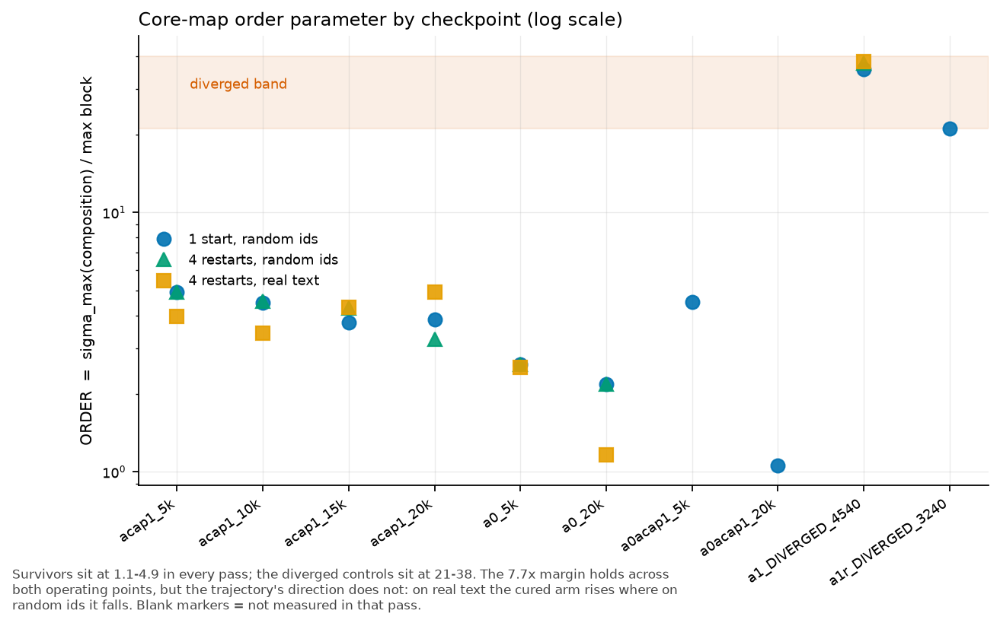

# Experiment: is `ademamix_alpha_cap=1.0` a cure or a delay?

Status: failure

Follows `../failures/2026-08-22-tul-divergence-cause.md`, whose own "Next planned
experiment" section names this measurement. Costs zero training: it reads checkpoints
that already exist.

## Question

`tul_short.yaml` now ships `training.ademamix_alpha_cap: 1.0`. That value carried two
TUL arms to 20000 steps where the uncapped recipe detonated 5/5. Tonight's campaign runs
at **batch 12**, not the batch 14 that produced that evidence. Batch size sets the
gradient noise scale, which is the drive feeding the slow EMA that the cap throttles.

So: does the cap **suppress the mechanism**, or does it only **slow the approach** to the
same cliff? A suppressed mechanism transfers to batch 12. A slowed approach does not.

## The quantity

Task #276 states the mechanism as subspace alignment, not magnitude. The six core blocks
each stay individually calm while their top singular subspaces rotate into alignment, so
the blocks chain multiplicatively instead of cancelling. The order parameter is

    ORDER = sigma_max(J of the whole core step) / max_i sigma_max(J of block i)

Reference values from Task #276: **~0.90 healthy** (blocks cancel), **~9.5 at the cliff**
(blocks aligned). Those come from a different model, so this run also measures A0 and A3
— arms that never diverged — to establish the healthy value **for this architecture**.

Every per-linear sigma number in the prior RCA is a different quantity. Alignment can
inflate ORDER while every per-linear sigma stays flat, which is precisely why the RCA
concluded "sigma is a correlate, not the trigger".

## Method

`ignore/perf/order_param.py`. Estimator and both validation gates ported verbatim from
the already-validated `00-MORPH-ademamix-b1zero/ignore/E2_sigma_on_ckpt.py`.

- sigma_max by power iteration on JtJ: forward-difference JVP, autograd VJP, k=60.
- fp32 throughout. The FD step is 1e-3 relative, which is fine in fp32 and noise in bf16.
- **Gate A** — the estimator must recover sigma_max=6.04 on a non-normal matrix whose
  spectral radius is 0.5. This separates sigma_max from rho; an estimator that returns
  rho would pass a normal-matrix test and fail here.
- **Gate B** — `_apply_core_step` must reproduce the real forward's iteration-0 core
  output to < 1e-4. Without this the probe measures a map the model does not run.
- Either gate failing aborts the script rather than printing a number.
- Fixed seed 1234, batch 2, seq 256, identical token ids for every checkpoint. Random
  ids, matching the reference instrument. Off-distribution for a language model, so the
  ranking gets a real-text spot check on two checkpoints afterward.
- `slot_layout=None` for every checkpoint. This measures the **weight-space** map at one
  common operating point. The A1 arms are therefore probed off their training
  distribution; the confound-free comparison is A1-vs-A1, and A0/A3 are context only.
- Checkpoints: `tul-a1/DIVERGED_step_4540`, `tul-a1r/DIVERGED_step_3240`,
  `tul-a1-acap1/step_{5000,10000,15000,20000}`, `tul-a0/step_{5000,20000}`,
  `tul-a3/step_{5000,20000}`.

## Already known before the predictions below

The smoke run measured `acap1_5k`: composition 76.18, worst block 16.93,
**ORDER = 4.500**, realized gain 1.270. Both gates passed, Gate B at exactly 0.000e+00.
That number is data, not a prediction, and is excluded from scoring.

## Predictions

1. Both diverged controls score **ORDER > 6**, above every surviving arm's value at a
   comparable step. If a diverged checkpoint scores below the cured arm, the order
   parameter does not separate divergence in this model and the whole framing is wrong.
2. The cured trajectory 5k -> 20k **rises by less than 1.0 absolute** (4.50 -> under
   5.5). A rise past 6 means the cap delays rather than cures.
3. A0 and A3 — the arms that never diverged — sit **below 4.0** at both 5k and 20k, and
   their 5k -> 20k drift is smaller than A1-acap1's.
4. Per-block sigma stays within a factor of 2 across every checkpoint, diverged included.
   This is the alignment claim: the runaway lives in the composition, not the blocks. If
   the diverged controls also show blown-up per-block sigma, then magnitude explains the
   divergence and alignment is not needed.

## Decision rule

- Predictions 1 and 2 both hold -> the cap suppresses the mechanism. Batch 12 is
  acceptable risk. Run the arms.
- Prediction 1 holds and 2 fails -> the cap only delays. Batch 12 changes the drive, so
  the arms need a live ORDER readout with an abort threshold before they run overnight.
- Prediction 1 fails -> the order parameter does not discriminate here. Report that
  plainly and do not use it as a gate.

## Risks

- n=1 per condition. This ranks checkpoints; it does not prove causation, exactly the
  error the parent experiment made. The claim stays at "the order parameter does / does
  not separate the diverged from the survivors".
- Random-token operating point may not reflect real-text Jacobians. Mitigated by the
  spot check, not eliminated.
- A0 is a no-TUL arm probed at its native operating point while A1 is probed off its own.
  Any A0-vs-A1 difference carries that confound. A1-vs-A1 does not.

## Amendment 1 (2026-08-22, before any result beyond the smoke)

Two errors in the Method above, both found by reading the arm configs, both fatal to the
run as written. Predictions are untouched.

1. **`tul_a3` is removed from the checkpoint list.** It sets `model.n_core: 0` — it is
   the compute floor, prelude and coda only. There is no core to compose, so the order
   parameter is not "low" for A3, it is **undefined**. `measure()` now raises with that
   message rather than calling `max()` on an empty list. Prediction 3 therefore scores on
   A0 alone, which weakens it: one healthy arm, not two.
2. **Each checkpoint now names its own config.** `tul_a0` sets `tul.activate_at: never`
   and so constructs **no** slot parameters. Building every checkpoint from `tul_a1.yaml`
   would have made every A0 load trip the material-missing guard and abort the script —
   at checkpoint 7 of 10, after roughly an hour, discarding six completed measurements to
   stdout buffering. The runner now passes `LABEL=CONFIG=PATH`, the script prints the
   running table after every checkpoint, and it runs under `python -u`.

Added while fixing the list: `tul-a0-acap1` at 5k and 20k. A0 under the cap is the
control that separates "the cap changes the core map" from "TUL changes the core map".
Without it, any A0-vs-A1-acap1 difference confounds the two.

Final list, ordered by decisiveness so rows 1-4 answer the question:
`a1_DIVERGED_4540`, `acap1_5k`, `acap1_20k`, `a1r_DIVERGED_3240`, `acap1_10k`,
`acap1_15k`, `a0_5k`, `a0_20k`, `a0acap1_5k`, `a0acap1_20k`.

Runner: `ignore/perf/run_order_param.sh`. Not yet run — the GPU is in use.

## Results (2026-08-22, `ignore/perf/order_param_full.log`)

Ten checkpoints. Gate A passed. Gate B passed at **exactly 0.000e+00 on every one**.
Zero material-missing keys on every load. Random ids, seed 1234, batch 2, seq 256,
identical for all rows. `k=60`.

| label | cap | TUL | step | composition | worst blk | **ORDER** | realized |
|---|---|---|---|---|---|---|---|
| a1_DIVERGED_4540 | 3.5 | yes | 4540 | 40556.21 | 1140.03 | **35.58** | 51.46 |
| a1r_DIVERGED_3240 | 3.5 | yes | 3240 | 53110.95 | 2519.87 | **21.08** | 97.02 |
| acap1_5k | 1.0 | yes | 5000 | 83.26 | 16.93 | **4.92** | 1.27 |
| acap1_10k | 1.0 | yes | 10000 | 91.52 | 20.36 | **4.50** | 1.30 |
| acap1_15k | 1.0 | yes | 15000 | 160.88 | 42.72 | **3.77** | 1.41 |
| acap1_20k | 1.0 | yes | 20000 | 197.18 | 50.92 | **3.87** | 1.45 |
| a0_5k | 3.5 | no | 5000 | 75.89 | 29.15 | **2.60** | 1.64 |
| a0_20k | 3.5 | no | 20000 | 118.93 | 54.49 | **2.18** | 2.57 |
| a0acap1_5k | 1.0 | no | 5000 | 110.12 | 24.37 | **4.52** | 1.46 |
| a0acap1_20k | 1.0 | no | 20000 | 69.11 | 65.22 | **1.06** | 1.64 |

### Scoring

| # | prediction | verdict |
|---|---|---|
| 1 | both diverged controls score ORDER > 6 | **correct**, 35.58 and 21.08 — a different scale entirely from every survivor (1.06–4.92) |
| 2 | cured trajectory rises by less than 1.0 (4.50 -> under 5.5) | **correct in direction, and then some** — it FELL, 4.92 -> 4.50 -> 3.77 -> 3.87 |
| 3 | healthy arms sit below 4.0 at both 5k and 20k | **half wrong.** True for `tul-a0` (2.60, 2.18). FALSE for `tul-a0-acap1` (4.52 at 5k) — an arm that finished 20k at val CE 3.2805. ORDER ~4.5 is compatible with a perfectly healthy run |
| 4 | per-block sigma stays within a factor of 2, runaway lives in the composition | **falsified.** The diverged blocks grew 67x (16.93 -> 1140.03). This is NOT pure alignment; magnitude exploded too. Alignment rose as well (4.9 -> 35.6), so both move together |

### What the control bought

`tul-a0-acap1` was added in Amendment 1 and it changed the reading. At 5k:
A0 uncapped 2.60, A0 **capped** 4.52, A1 capped 4.92. **The cap raises ORDER, not TUL.**
Going from cap 3.5 to 1.0 moves ORDER 2.60 -> 4.52 in an arm with no TUL at all; TUL then
adds only 4.52 -> 4.92. Without this row the cured arm's elevated ORDER would have been
credited to TUL, which is wrong.

### The shape that repeats

**Every surviving arm's ORDER falls over training** while its magnitudes grow:

- `tul-a0` 2.60 -> 2.18 (worst blk 29.2 -> 54.5)
- `tul-a0-acap1` 4.52 -> **1.06** (worst blk 24.4 -> 65.2 — composition ~ worst block, i.e.
  the six blocks end up very nearly cancelling)
- `tul-a1-acap1` 4.92 -> 3.87 (worst blk 16.9 -> 50.9)

A falling ORDER with growing per-block sigma is therefore what ordinary training looks
like in this architecture. The cured TUL arm has that shape. It ends ~3.7x above the
capped no-TUL arm (3.87 vs 1.06), so TUL does keep the core more aligned — but declining,
and nowhere near 21+.

`realized_gain` is **not** a danger signal: the healthiest arm, `tul-a0`, has the highest
value among survivors (2.57 at 20k) while the cured TUL arm sits at 1.45.

## Verdict

**The cure reading is supported: the capped trajectory does not walk toward the cliff.**
It has the same declining shape as two independent healthy arms and ends an order of
magnitude below both diverged controls.

**It is NOT proven, for three reasons that this design cannot retire.**

1. **The diverged evidence is post-mortem.** DIV-GUARD writes those checkpoints after two
   consecutive evals at ppl > 1000. ORDER 21-36 is the state at death. This establishes
   that the metric separates dead from alive; it does **not** establish that ORDER climbs
   *before* death, which is the only thing that would make it an early-warning signal.
   The checkpoints that would show the run-up do not exist: every diagnostic arm (D, E, F,
   placebo) ran `ckpt_every=100000` on runs lasting <= 6600 steps and saved nothing.
2. **The decline is close to the estimator's scatter.** The unseeded start vector made the
   same checkpoint score composition 76.18 then 83.26 — 9% — against a decline of ~20%.
   Power iteration approaches sigma_1 from below, so every number here is a lower bound.
   Fixed (seeded, `--restarts`); **re-measured, see Amendment 2 — reason 2 is retired.**
3. **Every number is from batch 14.** The campaign runs batch 12.

Because of 1 and 2 this file goes to `failures/`, not `successes/`: predictions 3 and 4
were wrong, and the central question — cure or delay — is answered by a *trajectory
shape* argument, not by the precursor evidence the design set out to get.

### Next planned experiment

Not another offline probe. The missing evidence is a **precursor**, and only a live run
produces it: log ORDER during training and see whether it rises before a detonation.
That also gives the abort threshold this campaign lacks. Cheap at low `k` and a coarse
interval — measure cost 2 s per call at batch 2 / seq 256 against ~0.53 s training steps.

## Figure

Data: [`../results/tul_order_parameter.csv`](../results/tul_order_parameter.csv).
Regenerate: `python scripts/plot_tul_arms.py --only order`.

## Amendment 2 — the two follow-up passes (2026-08-23)

`ignore/perf/run_order_param_check.sh`, both at `--restarts 4`. Logs:
`ignore/perf/order_param_restarts.log`, `ignore/perf/order_param_check_driver.log`.
Best-of-N is the estimate (power iteration rises toward sigma_1); best-vs-worst is
reported as `comp_spread` and is the convergence check reason 2 above asked for.

| checkpoint | pass 0 (1 start) | PASS 1 (4 restarts, random ids) | PASS 2 (4 restarts, real text) |
|---|---:|---:|---:|
| `acap1_5k` | 4.918 | 4.922 | 3.977 |
| `acap1_10k` | 4.496 | 4.560 | 3.412 |
| `acap1_15k` | 3.766 | 4.270 | 4.307 |
| `acap1_20k` | 3.872 | 3.253 | **4.916** |
| `a0_5k` | 2.603 | 2.603 | 2.525 |
| `a0_20k` | 2.183 | 2.183 | 1.163 |
| `a1_DIVERGED_4540` | 35.575 | 37.515 | 38.217 |

`comp_spread` ranges 3.5-33.5 % across the rows.

**Reason 2 is retired, in the direction that supports the verdict.** Better convergence
made the random-token decline *steeper* (4.92 -> 3.25, not 4.92 -> 3.87). An
under-convergence artifact would have shrunk. It grew.

**A new limitation replaces it: the trajectory's sign is operating-point dependent.** On
real validation text the cured arm RISES, 3.977 -> 4.916, instead of falling. The
pre-registered bar still passes by the letter — a rise of 0.939 against a 1.0 limit,
ending at 4.916 against a 5.5 ceiling — but that is a tight pass with a ~12 % spread on
the estimate, not a comfortable one. "Does ORDER creep upward during a healthy run?" is
**unresolved**, and the random-token answer and the real-text answer disagree.

**What does NOT depend on the operating point** is the separation, which is the quantity
the campaign decision rests on:

| | pass 0 | PASS 1 | PASS 2 |
|---|---:|---:|---:|
| diverged | 35.6 | 37.5 | 38.2 |
| worst survivor | 4.92 | 4.92 | 4.92 |

Three passes, two operating points, a 7.7x margin every time. For a survivor to reach the
diverged band its composition estimate would have to be understated by 4.3x; the largest
scatter measured anywhere is 33.5 %. Reason 1 (post-mortem evidence) and reason 3
(batch 14) are untouched, so this file stays under `failures/` and the next step is still
the live readout.
