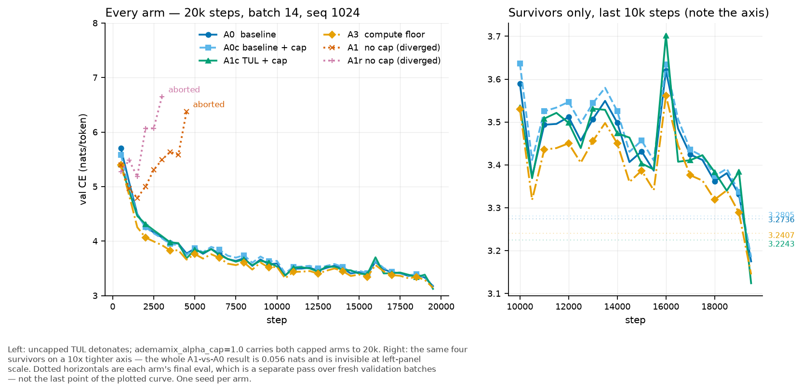
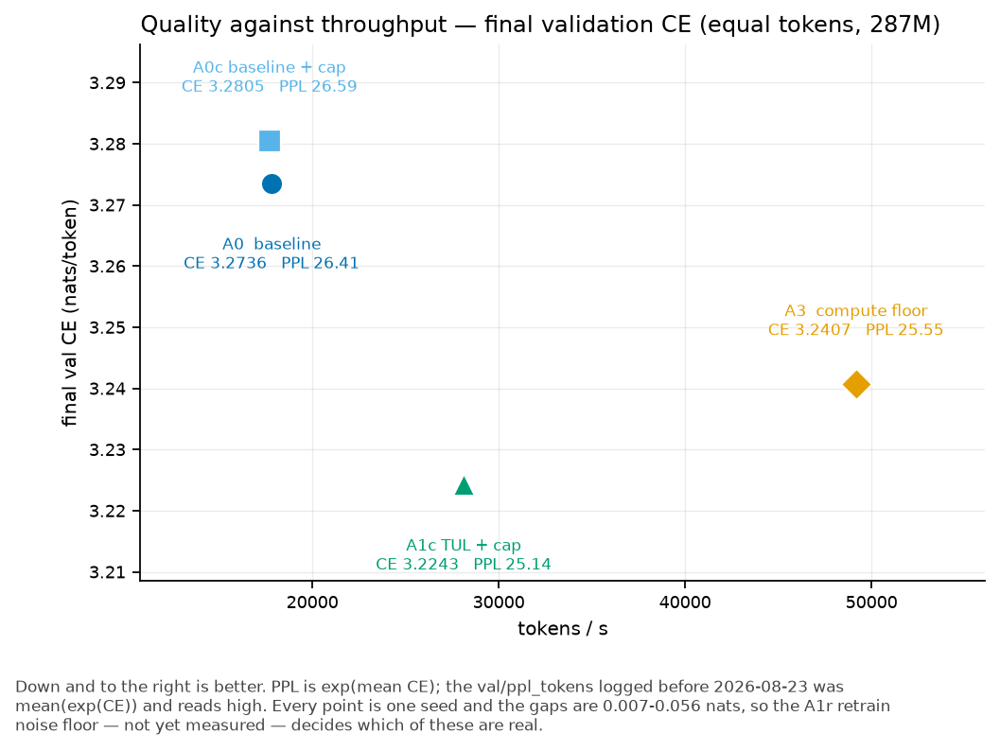

# TUL arms — the first complete comparison (2026-08-18)

A1 finished. Two pre-registered questions can now be answered, one cannot, and one
metric points the other way. All four are below.

Runs: `tul-a0-acap1` (278 min) and `tul-a1-acap1` (177 min), both 20000 steps, batch 14,
seq 1024, one epoch, `ademamix_alpha_cap=1.0`, `token_state_dropout=0.15` (spec).
Queue `ignore/tul_logs/run_tul_arms2.sh`, commit `4650cb1`. wandb project `morph-tul`.

## Figures

The right panel is the one to read. On the left axis every surviving arm is one line;
the entire result is 0.056 nats wide.

A3 is the uncomfortable point: no core at all, 2.76x the baseline's throughput, and it
still beats the baseline on CE. At 287M tokens the loop is not paying for itself. The
iso-depth scaling law says that payoff grows with budget, so this may be a small-budget
artifact — but it is what these runs measure.

Regenerate: `python scripts/plot_tul_arms.py`. See [the experiments README](../README.md).

## The numbers

| arm | cap | final val CE | ppl | note |
|---|---|---|---|---|
| A0 (stored, first pass) | 3.5 | 3.2736 | 26.41 | reference only — NOT the comparison |
| **A0c — dense baseline** | 1.0 | **3.2805** | 26.59 | the number A1c is read against |
| A3 — compute floor | 3.5 | 3.2407 | 25.55 | see the caveat below |
| **A1c — the method** | 1.0 | **3.2243** | 25.14 | `val/ce_tokens_final`, the comparable metric |

**PPL corrected 2026-08-23.** This row read **25.89** until then, which is the figure
wandb logged as `val/ppl_tokens`. That metric was accumulated as the mean of the
per-batch `exp(CE)` while every other row in this table is `exp(mean CE)`; Jensen makes
the first strictly larger, so the table compared A1c against A0c under two different
aggregations. `exp(3.2243)` is **25.14**. The CE column was never affected — it is a
plain mean and is correct as logged. Fixed in `morph/training/train.py` with two
regression tests; see
[the note](../../../.agents/notes/implemented/bug-fix/2026-08-23-val-ppl-tokens-aggregation.md).
The error was 0.75 PPL against a 1.27 PPL A1-vs-A0 effect, so it hid 59 % of the result
it was reporting.

A1c is quoted on `val/ce_tokens`, which is CE over token positions only (ordinary +
`t_last`). That is the metric §4 defines as comparable to a baseline's token CE; A1's
`val/loss` is the weighted double label and is not comparable to A0's. Both readings
agree here: `val/loss_final` is 3.2273, `val/ce_tokens_final` 3.2243.

* **A1c beats A0c by 0.0562 nats** at 10.86 layer passes per token (measured,
  `val/layer_passes_per_token_final`).
* The cap cost the baseline 0.0069 nats (A0c 3.2805 against the stored A0 3.2736).

## 1. The cap prevented the takeover — it did not merely delay it

This was the stated risk: the cap was verified to 4800 steps and these runs are 20000.
A1c logged 200 gradient-share points and **the core share crossed 0.5 exactly once**
(peak 0.8647, a single point, the transient shape from RCA §21), ending at 0.0380 with
`train/grad_norm` 0.8612. No `[ABORT]`. Held over 4× longer than the evidence for it.

## 2. The "Works" gate cannot be evaluated, and that is the honest state

Spec §7.3 sets it as **`plan_nats > A1r spread`**. Measured `val/plan_nats_final` =
**+0.0270** — positive, so removing the slots from the coda's sequence *does* cost the
model something, i.e. the coda is using the plan. But **A1r never completed** — it
aborted at step 3240 — so there is no spread, and +0.0270 cannot be called larger than a
number nobody has measured. The gate is unevaluated, not passed.

What it costs to close: one replicate of `tul-a1-acap1` at a second seed, ~3 h.

## 3. The plan loses to the trivial channel at the job it exists for

`val/first_tok_counterfactual_final` = **−0.1196**, defined `ce_plast − ce_emit`, where
positive means the plan helps. So:

* predicting a span's first token **from the previous token**: CE **2.890**
* predicting it **from the slot**: CE **3.010**

The plan is 0.12 nats *worse* than just reading `t_last` at the first token of a span —
the one prediction the latent plan is built to make. It is not a contradiction with
§2: `plan_nats` is averaged over all span tokens and is small and positive, while this
is the first token alone. Read together they say the slot contributes a little on
average and is beaten by the cheap channel where it should be strongest.

## 4. Beating A0 is not the gate anyway

Spec §7.3, last line: "Beating A0 on `val/ppl_tokens` is NOT a gate at this scale (§1)."
The 0.0562 nats is real and measured, and it is not what the method is being judged on.

## Caveats

* **A3 ran at cap 3.5**, so "A1c clears the A3 floor by 0.0164" carries exactly the
  two-variable problem the A0 re-run was done to remove. An A3 at cap 1.0 (~1 h 40 m,
  it has no core) would fix it.
* **n = 1 per arm.** Every number here is a single run. The 2026-08-17 lesson was that
  single runs of a bimodal process measure trajectory, not method. These arms are not
  bimodal in the same way — both finished cleanly — but 0.0562 nats has no error bar.
* **Generation was not read.** §7.3 also gates on rep4@512 ≤ A0's and no span-length
  collapse. `val/span_mean_span_final` is 19.88 with `span_cap_frac` 0.2809, which is in
  range, but rep4 and distinct-3 have not been computed.
* A0 logs no `layer_passes_per_token`, so the compute ratio against A1c's 10.86 is not
  measured here, only A1c's own figure.

## Generation, 512 tokens, both arms from `step_20000.pt`

Script `ignore/tul_logs/gen_compare.py`, samples in `ignore/tul_logs/gen_compare.txt`.
Five prompts, one seed each, greedy and sampled (temperature 0.8, top-k 50).

| mode | arm | rep4@512 | distinct-3 |
|---|---|---|---|
| greedy | A0c dense | 0.9375 | 0.0576 |
| greedy | **A1c TUL** | **0.9246** | 0.0710 |
| sampled | A0c dense | 0.4177 | 0.5384 |
| sampled | **A1c TUL** | **0.3084** | 0.6459 |

`rep4` is Welleck's rep-n: the fraction of 4-grams that are repeats, so lower is better.
Spec §7.3's generation gate is **`A1's rep4@512 ≤ A0's`**, and on these means A1c meets
it in both modes.

**The mean hides a 3–2 split, so do not read it as a clean win.** Per prompt, sampled:

| prompt | A0c rep4 | A1c rep4 |
|---|---|---|
| The theory of relativity states that | 0.625 | **0.177** |
| Once upon a time in a distant land | **0.094** | 0.442 |
| In machine learning, the key insight is | 0.758 | **0.216** |
| The capital of France is | 0.550 | **0.130** |
| `def quicksort(arr):` | **0.061** | 0.578 |

A1c wins three and loses two, and the losses are as large as the wins. At five prompts
and one seed the mean is not a reliable ordering.

**Both arms are degenerate under greedy decoding.** rep4 near 0.93 for both: A0c loops
"The 1990s and 1990s were the most effective and effective methods of relativity", A1c
loops "the term" or "the term". Neither model is usable greedy at 20k steps, and the
greedy row of the gate is a comparison between two collapsed outputs.

Where a difference is visible by eye, it is topical persistence under sampling. On the
relativity prompt A1c stays on subject — "theories", "scientific evidence", "assumptions"
— while A0c drifts to a school system and then loops on "Mormon". That is one prompt,
read by eye, and it is not a measurement.

**Neither arm can write code.** Both continue `def quicksort(arr):` as English prose.

A1c's span statistics track the failure mode: the greedy loops sit at `mean_span` 32.4
and 32.6 against a `span_cap` of 32 — the boundary rule is capping out inside the loop —
while the sampled runs sit at 15.7–21.7, near the training data's 19.9.

### A bug this uncovered

`base.yaml` ships `gen_every: 0` and `gen_test: false`, and neither arm log contains a
single `PROMPT:` line, so **generation had never once run on this config**. The first
attempt crashed in `GatedPoolCompressor`: with a prompt shorter than the CSA block size
of 8, the two-stream path padded an empty block dimension into ONE block while the
A-stream still had none, and the joint `cat` died. Fixed in `morph/model/attention.py`
by returning an empty `[B, 0, c]`, which is what the single-stream branch already did.
Regression test `tests/test_compressor_short_seq.py`, mutation-checked: 3 of its 9 cases
fail with the guard removed. Full suite 125 passed.

Loading the checkpoints also needed the trainer's QAT transforms, because each registers
a `parametrize` hook that renames tensors in `state_dict` — a plain model reported 45
missing and 45 unexpected, and `strict=False` would have sampled a half-initialised
network. Rather than copy that block into the sampler, it moved to
`morph/training/quant_setup.py` and both callers now use it.

### What the sampled text actually looks like

Both arms write fluent, locally grammatical English with correct quoting and plausible
discourse furniture ("Advertisement", "says Karen Chaney, who has worked with us since
2005"). Neither holds meaning past a sentence or two. Neither knows facts: given "The
capital of France is", **both** continue "not necessarily…" and neither ever says Paris.
At 286M parameters and 20k steps that is the expected level, and on raw language quality
the arms are not distinguishable by eye.

**They fail in different units, and that is measurable.** Mean `rep_n` over the sampled
continuations, as the repeat unit grows:

| arm | n=1 | n=2 | n=4 | n=8 | n=16 | n=32 | n=64 |
|---|---|---|---|---|---|---|---|
| A0c dense | 0.726 | 0.542 | 0.418 | 0.336 | 0.237 | 0.088 | 0.017 |
| A1c TUL | 0.679 | 0.443 | 0.309 | 0.217 | 0.151 | **0.104** | **0.077** |

A0c repeats more at every short unit and its repetition **collapses** by n=64 (0.017).
A1c repeats less at short units but **more at long ones** — 4.5× A0c at n=64. The
crossover sits near n=32, which is `span_cap`.

That matches the text. A0c's failure is token-local churn that never escapes:

> "— 20:38 – 20:34 – 20:34 – 20:34 – 20:37 – 20:38 – 20:31 – 21:37 – 20:38 …"
> "identified as Psychological Association members … have been identified as American
> or have been identified as Psy"

A1c's failure is **restating a whole span**, a paragraph later, slightly rephrased:

> "The 2016 season was finally in a fight for Arena, but with the new Dota 2 sequels
> going off the tongue-in-cheek-themed …" — three times, each a variant.

And A1c is bimodal about it. Per-prompt `rep_32`: 0.000, 0.106, 0.000, 0.000, 0.412. On
three prompts it is perfectly clean at span scale; on two it locks into a span loop.
A0c is uniformly mediocre instead — moderate churn everywhere, long loops rarely.

**This is why the 3–2 rep4 split is not a wash: `rep4` scores the two arms on an axis
that penalises A1c's failure and rewards A0c's.** A0c's two "wins" are its highest-entropy
outputs, and they are word salad — prompt 1 scores rep4 0.094 while reading "those who
are able to experience a common truth in a world that is very much a fetish for a nation".
Varied and meaningless beats repetitive and coherent under `rep4`. The metric cannot tell
them apart, so the gate it feeds should not be read as a quality ordering.

**Hypothesis, not a finding.** Span-scale restatement is what a weak plan would produce:
if the slot state is a low-information summary that lands in a similar place twice, the
coda emits a similar span twice. That is the same direction as
`first_tok_counterfactual = −0.1196` — the slot being a worse span-opener than the
previous token. It is also consistent with the plan doing nothing in particular.

The cheap test, on the checkpoint already on disk and needing no training: capture the
slot states during a sampled run and measure cosine similarity between the slots of
repeated spans against non-repeated ones. If repeated spans come from near-identical
slots, the plan is collapsing to a few attractors — the `z = h` family. If they do not,
the restatement is coming from somewhere else and the plan is not implicated.

## The slot-collapse probe — and what it actually found

`ignore/tul_logs/slot_collapse_probe.py`, A1c `step_20000`, five sampled 512-token
continuations, 134 spans, 1756 span pairs. No training. Results in
`ignore/tul_logs/slot_collapse.json`.

The hypothesis was: span-scale restatement happens because the plan collapses, so two
similar slots emit two similar spans. The first run seemed to confirm it — repeated spans
had slot cosine 0.879 against 0.670 for unrelated spans.

**That reading was circular, and two controls killed it.**

**Control 1 — the pre-core state.** Two spans with the same text have nearly the same
slot state before the core *by construction*, since the slot's input is `E_slot` + the
bag-mean of its own span's token embeddings (§3.2). Measured, the separation is LARGER
before the core loop than after it:

> **CORRECTION, 2026-08-18.** This row was first written up as "the raw bag-mean input".
> That is WRONG and the error propagated into a design argument. The probe captures the
> first argument to `_tul_core`, which is the output of `_tul_front` — and `_front_tail`
> runs all four PRELUDE blocks over every position, slots included
> (`transformer.py:920-942`). So the captured vector is the slot state AFTER the prelude:
> contextual, having attended to the real token positions, not a bag of embeddings.
> What the numbers below show is that **the 6-block core loop adds almost nothing over
> the 4-layer prelude on the slot path** — not that the slot is a bag-of-words. The claim
> "the slot cannot carry computed information" does not follow and is retracted.

| signal | repeat pairs | distinct pairs | gap |
|---|---|---|---|
| pre-core input | 0.9077 | 0.5480 | **0.3597** |
| post-loop `h` | 0.8682 | 0.6584 | 0.2098 |

The loop does not create the similarity. It inherits it and washes some out.

**Control 2 — the pairing was wrong.** `TulRowBuilder.append` inserts the slot AFTER its
span's tokens ("the slot that will close this span"), and the double label has the slot
predict the first token of the **next** span (`ce_emit` against `ce_plast`). So slot *i*
summarises span *i* and conditions span *i+1*. Correlating slot *i* with span *i*'s own
text is an autoencoding relation. The predictive relation is slot *i* against span *i+1*:

| pairing | signal | repeat | distinct | gap | Spearman |
|---|---|---|---|---|---|
| self (circular) | pre-core input | 0.9077 | 0.5480 | 0.3597 | +0.4831 |
| self (circular) | post-loop `h` | 0.8682 | 0.6584 | 0.2098 | +0.3723 |
| **next span (real)** | pre-core input | 0.8268 | 0.5606 | 0.2662 | **+0.2187** |
| **next span (real)** | post-loop `h` | 0.8560 | 0.6642 | 0.1917 | **+0.2321** |

### What this says

1. **The original hypothesis is not supported.** Nothing here shows the loop concentrating
   plans into attractors. It raises the similarity floor uniformly (distinct pairs 0.56 →
   0.66) and compresses the cosine range (p05–p95 0.575 → 0.475) while nearest-neighbour
   retrieval of the most text-similar span is unchanged (0.303 → 0.315, chance 0.038).
   That is mild global compression, not collapse, and it does not explain the restatement.
2. **Plans are not random.** On the predictive pairing, slot similarity does track
   next-span similarity, Spearman +0.2321.
3. **The core loop adds essentially nothing to the plan.** Spearman against the next span
   goes +0.2187 (post-PRELUDE slot state) → +0.2321 (after 6 blocks × Poisson depth).
   The expensive loop does not measurably improve what the slot says about what comes
   next, over what four prelude layers already gave it. NOTE the corrected baseline: this
   is loop-vs-prelude, NOT loop-vs-bag-of-words. The slot has attended to its context
   before the core ever runs.

Point 3 is the consequential one, and it is the same story `val/plan_nats = +0.0270` and
`val/first_tok_counterfactual = −0.1196` were already telling from the loss side. Three
independent measurements now agree that the slot carries very little beyond its input.

### Limits

* This is a **re-analysis forward** over the finished text, not the states that existed
  during sampling. It answers "what does the plan encode", not "what did the plan do at
  decode time". Capturing per-step slot states during generation is the next step.
* 5 prompts, 1 seed, 134 spans. The 1756 pairs are not independent — they come from those
  134 spans — so the Spearman values carry no error bar and the +0.013 input→`h` change
  should be read as "no measurable gain", not as a measured small gain.
* `text_sim` is `difflib` ratio over token ids with thresholds 0.60 and 0.20; the
  qualitative ordering held at the smoke-test size too, but the thresholds are a choice.

## Arm CW re-scored by stratum — the aggregate win reverses where it matters

`ignore/tul_logs/cw_rescore_stratified.py`, same checkpoint and cut (576), 200 batches,
1.42M scored tokens. For each scored position, `prev` is the last input index holding the
target token. Three strata: **A** `prev < cut` (the only prior sighting is inside the
deleted text), **B** `prev >= cut` (available in kept context), **C** no prior sighting.

| stratum | share | CW0 | CW1 slots | CW2 random | CW3 | CW2−CW1 | 95% CI |
|---|---|---|---|---|---|---|---|
| **A needs-old** | 15.8% | 3.2196 | **3.4454** | **3.3466** | 3.4721 | **−0.0988** | [−0.1050, −0.0933] |
| B local | 47.6% | 2.1280 | 2.1347 | 2.1736 | 2.1715 | +0.0388 | [+0.0370, +0.0407] |
| C novel | 36.5% | 4.8603 | 4.8794 | 4.8954 | 4.8997 | +0.0160 | [+0.0143, +0.0176] |

**On the tokens that can only be known from the deleted text, an equal-budget RANDOM
sample of the real tokens beats the slots by 0.0988 nats.** Significant, and it is the
reverse of the aggregate result (+0.0090 in favour of slots over all tokens).

Stratum C was pre-registered as the control: copying from the deleted region cannot help
there, so a slot advantage in C cannot be memory. The slots win C by +0.0160. So the
aggregate advantage lives in the two strata where the deleted content is not needed, and
reverses in the one where it is.

### Reading

The slot is not acting as a memory of its span's content. Its measurable benefit sits on
predictions that never needed the deleted text — consistent with slot positions acting as
extra compute registers plus aux-loss regularization, not as a summary.

The mechanism behind A is unsurprising once stated: CW2 keeps 128 of ~500 deleted token
positions, so roughly a quarter of the time it retains the *exact* token the target
repeats. A lossy mean over a span can never do that. **For the long-range dependencies
that actually occur in this data — largely token repetition — an exact copy of a random
quarter beats a gist of everything.**

### What this does and does not settle

* It does NOT say the design fails: nothing trained this checkpoint to make the slot
  carry span content, and the whole point of arm CW's training version is to force it.
* It DOES say the aggregate screen number (+0.0090, "slots beat random tokens") should
  not be quoted as evidence of memory. It is carried by strata where memory is irrelevant.
* It sharpens what training would have to buy: the slot must preserve token IDENTITY for
  rare repeated tokens, not just gist. A mean over embeddings cannot, which points at a
  copy/pointer-shaped mechanism rather than a bigger summary vector.

### Not verified

One cut, one checkpoint, one CW2 seed. The strata are defined by exact token repetition,
which captures copying dependencies and misses semantic ones — a target that needs the
deleted text without repeating any token in it lands in C and is scored as "novel".
