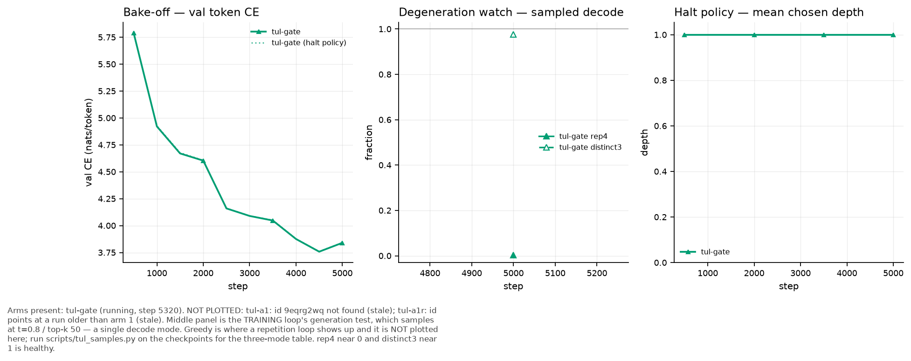

# Experiment: the gated-TUL bake-off, second attempt

Status: results (partial — the gate question is answered, its error bar is not)

Predictions pre-registered in `docs/tul-gate-spec.md` §11, commit `3bad5eb`. The first
attempt is [2026-08-21-tul-gate-bakeoff.md](../failures/2026-08-21-tul-gate-bakeoff.md),
which produced no verdict because every arm died. This one produced two of three arms.

## Method as run

`ignore/perf/gate_bakeoff.sh`, sequential on the 5090, 20000 steps, **batch 12**,
`ademamix_alpha_cap: 1.0` now inherited from `tul_short.yaml` rather than a shell
override (the defect that lost the first attempt — see
[the note](../../../.agents/notes/implemented/bug-fix/2026-08-22-alpha-cap-belongs-in-a-config.md)).
Started 2026-08-23 02:44:47, ended 08:55:22.

| arm | seed | outcome | wandb |
|---|---|---|---|
| `tul_gate` (+ `TUL-halt` on the same weights) | 0 | finished 20k | `2rk7mguo` |
| `tul_a1` | 0 | finished 20k | `tul-a1` 08-23 |
| `tul_a1r` | 1 | **DIVERGED, aborted step 4160** | `0ujvtukf` |

## Result 1 — the gate pays, at identical compute

| | TUL-gate | TUL-A1 | Δ |
|---|---:|---:|---:|
| val CE (tokens) | **3.3121** | 3.4175 | **−0.1054** |
| val PPL (tokens) | **27.44** | 30.49 | −3.05 |
| first-token CE | 3.1370 | 3.2557 | −0.1187 |
| `plan_nats` | **0.1900** | 0.0045 | 42× |
| layer passes / token | 10.7517 | 10.7517 | identical |

The gate led at **26 of 30** matched evals, settling at −0.04 to −0.06 over the last
eight. `layer_passes_per_token` is equal to four decimals: the length head and budget
embedding do not change the loop budget, so this is not a compute trade.

`plan_nats` — CE-without-the-plan minus CE-with-it — separates by 42×. Confirmed against
three independent ungated runs, all at 0.003–0.007 (`tul-a1-acap1` at batch 14 read
0.007, this A1 at batch 12 reads 0.0045), so it is not a batch artifact. The gated coda
genuinely leans on the plan an order of magnitude harder.

**The error bar does not exist.** §11 states the falsifier against the A1/A1r retrain
noise floor. `tul_a1r` diverged, so for the SECOND campaign running there is no measured
retrain spread, and 0.1054 nats cannot be called larger than a number nobody has. The
gate result is a single seed-0 pair.

## Result 2 — TUL-halt: prediction holds, by degeneration

Pre-registered: *`TUL-halt` does not beat `TUL-gate` on val CE.* It held. Halt was worse
at 39 of 40 evals, by +0.003 nats on average (range +0.0068 to −0.0003).

But it did not compete and lose — it collapsed. `val/halt_depth_mean` was **1.00 at every
one of the 40 evals**: the gate always asked for the shallowest possible loop. The near-tie
on CE is a tie by degeneration, not by merit, and the same collapse appeared in the
2026-08-21 attempt. Shipping fixed depth is the right call, and the reason is that the
halting policy as built does not learn to vary depth at all.

The gate's own length head is weakly predictive: `gate_k_corr` 0.348,
`gate_k_abs_err` 7.87 tokens against a constant predictor's 8.70 — a skill of 0.82 tokens
on spans averaging 19.4.

## Result 3 — WITHDRAWN 2026-08-23: the repetition table had no baseline and the wrong length

> **This section's numbers are retracted.** Two defects, both found by Wolfe:
>
> 1. **No non-TUL arm was in it.** A0 builds no TUL parameters, so the sampler printed
>    `SKIP: this arm builds no TUL layout` and the table compared TUL against TUL. The
>    question "does the slot loop repeat less than a plain model" was never asked.
> 2. **128 tokens is below the metric's floor.** Real text was scored at `rep4 = 0.003`
>    from one batch of 8 rows. Over 256 rows at 128 tokens the same corpus gives
>    0.0154 ± 0.0385 with a MEDIAN of 0.0000 and 54 % of rows at exactly zero. The
>    anchor was a low draw from a floored distribution, and every sampled model row was
>    on that floor too (0.000–0.008), so nothing in the table could be ranked.
>
> Replacement, at 512 tokens with a real baseline and paired per-prompt statistics:
> [`2026-08-23-tul-repetition-sampled-decoding.md`](2026-08-23-tul-repetition-sampled-decoding.md).
> Its headline reverses part of what was written here: at top-k the gate is **better**
> than A1 by −0.251 rep4 (t = −3.27, 10/12 prompts), not worse.
>
> The one claim from this section that survives, restated at the right length: greedy
> decoding hides a severe repetition loop that the training loop's single decode setting
> never sees, and a DIVERGED model scores the best diversity numbers of any arm because
> incoherent text never repeats. **rep4 and distinct3 are collapse detectors, not quality
> metrics: read them only inside a band of comparable CE, and read the text.**

The withdrawn table, kept for the record (8 prompts × 128 tokens)

| arm | val CE | greedy | top-k 50 t=0.8 | ancestral t=1.0 |
|---|---:|---:|---:|---:|
| real text | — | 0.003 | 0.003 | 0.003 |
| TUL-gate | 3.312 | 0.756 | 0.185 | 0.000 |
| TUL-gate halt | — | 0.656 | 0.112 | 0.008 |
| TUL-A1 | 3.418 | 0.853 | 0.124 | 0.005 |
| a1r DIVERGED | 6.43 | 0.524 | 0.001 | 0.000 |

The 0.003 anchor and every model row here are length-artefacts. Do not cite them.

Gate vs A1 on generation is MIXED, not a sweep: the gate is less degenerate under greedy
(0.756 vs 0.853) and more under top-k (0.185 vs 0.124). What is consistent is
`on_boundary` — 0.93 vs 0.76 — the gate ends spans on real boundaries far more often,
which is what it was built to do.

## Result 4 — the cap is seed-fragile, and every prior survival was seed 0

| run | seed | batch | cap | outcome |
|---|---|---|---|---|
| `tul-a0-acap1` | 0 | 14 | 1.0 | finished 20k |
| `tul-a1-acap1` | 0 | 14 | 1.0 | finished 20k |
| `tul-gate` | 0 | 12 | 1.0 | finished 20k |
| `tul-a1` | 0 | 12 | 1.0 | finished 20k |
| **`tul-a1r`** | **1** | 12 | 1.0 | **DIVERGED 4160** |

Every capped run that ever survived is seed 0, four for four. The cap had been tested at
seed 1 exactly zero times before this campaign; its first test failed. The
[order-parameter probe](../failures/2026-08-22-tul-order-parameter.md) inherits the same
flaw — every `acap1` checkpoint it measured was seed 0 — so its "cure, not delay" reading
could not have caught this.

**Seed and batch are confounded.** Seed 1 has never been run capped at batch 14. Until it
is, "batch 12 broke it" and "seed 1 always breaks" are equally consistent with the data.

### What diverged, and the precursor

`spec/sigma_max`, the core map's spectral norm:

| step | 500 | 1500 | 2000 | 2500 | 3000 | 4000 |
|---|---:|---:|---:|---:|---:|---:|
| seed 1 (died) | 1.82 | 2.06 | 2.52 | 3.73 | 4.87 | 5.42 |
| seed 0 (lived) | 1.74 | 3.38 | 3.38 | 3.38 | 3.37 | 3.35 |

Seed 0 rises and **pins at 3.38**. Seed 1 crosses it at 2500 and runs away. Sigma was
already separating at step 2000, one eval BEFORE the gradient blew up.

The blow-up itself, seed 1 between 2000 and 2500:

| | 2000 | 2500 | 4000 |
|---|---:|---:|---:|
| `train/grad_norm` | 1.3 | 8.1e6 | 3.2e7 |
| `gradnorm/core` (share) | 0.108 | **0.999** | 0.903 |
| `gradnorm/coda` | 0.322 | 2.3e-06 | 4.4e-07 |
| `train/clip_factor` | 0.766 | 1.2e-07 | 3.1e-08 |

The core's gradient becomes ~10⁷× everything else; the single global clip then rescales
the whole vector by 1e-7 and the prelude, coda, embeddings and TUL parameters stop
learning. Exactly the signature the
[divergence RCA](../failures/2026-08-22-tul-divergence-cause.md) recorded for the uncapped
arms. The cap delayed it to step 2500; it did not prevent it.

This is the precursor the order-parameter note said was missing — in the cheap sigma form,
logged live, rather than the expensive Jacobian one measured post-mortem.

## What to do next

1. **Settle the confound.** Seed 1, batch 14, capped. ~3 h. Decides seed-fragility vs batch.
2. **Turn on the spectral penalty, ON SEED 1.** `spectral_penalty.py` exists and is off
   (`lambda: 0.0`). It is the only lever aimed at contractivity rather than at the
   symptom, which is what `CLAUDE.md`'s iterative-map section argues for. The RCA has an
   untested lead: `cap=2.0, lambda=10` reached 6600 steps at `grad_norm 0.77` and was
   never carried to 20k. Testing any stability fix on seed 0 proves nothing — seed 0
   survives regardless.
3. **Per-region gradient clipping.** Does not cure the divergence but stops one region
   from annihilating every other through a single uniform rescale.
4. **Live `sigma_max` abort near 3.5.** Already logged on every run. Turns a wasted 3-hour
   run into a 40-minute one.
5. **The A1r noise floor is still owed.** Two campaigns have failed to produce it. Until
   one does, no TUL cell — including this gate result — has an error bar.

## Unverified

- One seed per cell. That is the central weakness and it is the same one the previous
  campaign had.
- Generation was scored on 8 prompts at 128 tokens, which is below the metric's floor —
  see the withdrawal at Result 3 and the replacement note. The training loop's `gen/*`
  uses 3 prompts at 100 tokens and is on the same floor.
- Generation is not bit-reproducible: rep4/distinct3 repeat but `on_boundary` moved 0.93
  → 0.91 across two runs of the same script. Drift ~0.02 against arm gaps of 0.17.
- MAUVE and gen-PPL under an external scorer were not computed. rep4@512 now IS, in the
  replacement note.
- Every CE in this note is inflated by the causality defect in
  [`../../../.agents/notes/proposed/bug-fix/2026-08-23-retention-carry-breaks-causality.md`](../../../.agents/notes/proposed/bug-fix/2026-08-23-retention-carry-breaks-causality.md)
  — measured at +0.1433 nats, larger than this note's −0.1054 headline. The gate-minus-A1
  DIFFERENCE survives (both arms leak equally); the absolute numbers do not.
- The gate's cost in wall-clock was not isolated; `layer_passes_per_token` is a
  training-time count and does not price the length head.
