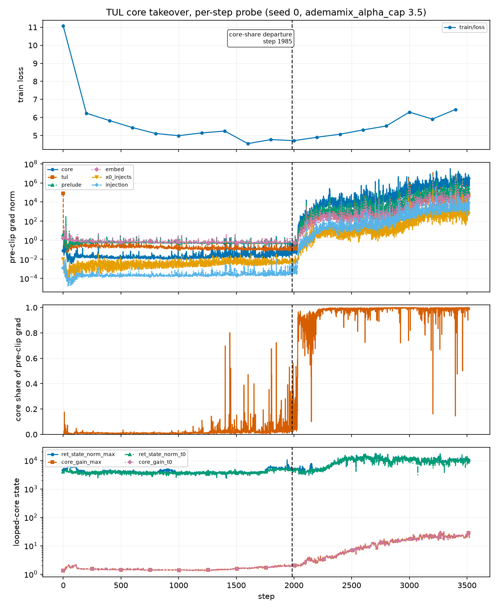

# Result: inside the TUL core takeover, at per-step resolution

Status: measured 2026-08-23. One run. The replication gate (Phase 0.4) is still OPEN —
read "What this run cannot say" before citing any of it.

Plan task 1.3 in
[`the divergence plan`](../../../.agents/notes/proposed/process/2026-08-23-divergence-root-cause-plan.md).
Nobody had ever looked inside the onset: every per-region gradient log was POST-clip and
every 100 steps, and the onset lasts about 140. This is the first per-step trace.

## Run

`phase1-onset-s0`, wandb project `morph-tul`. `tul_a1` with
`training.ademamix_alpha_cap=3.5` (the divergent control — `tul_short.yaml` ships the
cure, 1.0), seed 0, eval and generation disabled, `grad_probe_every=1`, 5000 steps.
Per-step probe at `ignore/perf/phase1/onset_s0.jsonl`, 45 series.

The run took over: `core` went from 1.5 % of the pre-clip gradient at step 1400 to 99.9 %
by 2400, and the divergence guard fired its first strike at step 2620.

## The analysis rule was fixed before the onset data existed

`ignore/perf/phase1/onset_order.py`, written and dry-run at step 853 of the run, before
any takeover was visible. For every series: baseline = median over a quiet window,
scale = MAD over the same window floored at 1 % of |baseline|, and **departure** = the
first step of a sustained excursion above `baseline + K·MAD` held for R consecutive
probed steps. A ratchet, not a threshold, because the gate arm once touched 0.3462 and
fell back without dying.

## The onset table

Loss is from the training stdout at the nearest logged step.

| step | train loss | core share | preclip/core | preclip/lm_mixer | gain t0 | gain t7 | ret_state max |
|---:|---:|---:|---:|---:|---:|---:|---:|
| 1400 | 5.2473 | 0.0145 | 0.0249 | 1.304 | 1.434 | 1.072 | 3479 |
| 1600 | 4.5500 | 0.0288 | 0.0357 | 0.919 | 1.593 | 1.096 | 3727 |
| 1700 | 4.5500 | 0.0313 | 0.0390 | 0.914 | 1.821 | 1.100 | 3976 |
| 1900 | 4.7736 | 0.0577 | 0.0764 | 0.978 | 1.935 | 1.089 | 5216 |
| 2000 | 4.7137 | 0.1798 | 0.1944 | 0.766 | 2.053 | 1.095 | 5175 |
| 2100 | 4.7137 | 0.8169 | 100.8 | 0.743 | 2.395 | 1.128 | 3912 |
| 2200 | 4.9050 | 0.9460 | 1767 | 1.055 | 2.500 | 1.100 | 4618 |
| 2400 | 5.0713 | 0.9981 | 4907 | 1.102 | 5.215 | 1.164 | 10640 |
| 2600 | 5.3098 | 0.9857 | 10720 | 1.177 | 8.290 | 1.164 | 10800 |
| 2800 | 5.5266 | 0.9987 | 33480 | 1.304 | 14.128 | 1.155 | 10770 |
| 3000 | 6.2965 | 0.9986 | 1.317e6 | 1.931 | 15.963 | 1.125 | 9985 |

## Findings

### 1. The runaway is confined to the FIRST loop iteration

This is the strongest result and it holds at every detection threshold tried
(K ∈ {5, 10, 20}, R = 25):

| series | baseline | final | departs, K=5 | K=10 | K=20 |
|---|---:|---:|---:|---:|---:|
| `core_gain_t0` | 1.422 | 16.93 | 1561 | 1792 | 2064 |
| `core_gain_t1` | 1.080 | 1.596 | 1697 | 2033 | 2179 |
| `core_gain_t2` | 1.130 | 1.293 | 2186 | never | never |
| `core_gain_t3` | 1.111 | 1.204 | 2619 | never | never |
| `core_gain_t4..t7` | 1.09–1.10 | 1.12–1.15 | never | never | never |

`core_gain_max` equals `core_gain_t0` at **every** probed step of the run: the looped
core's realized amplification is largest on its first application and decays monotonically
with the iteration index, before the onset and during it.

**This is evidence against a compounding-through-depth story.** If the disease were an
inner-map spectral radius crossing 1 and compounding as ρ^T, the LATE iterations would
carry the largest gain. They carry the least, and they never leave their baseline while
t0 grows 12×. The later iterations are contracting what the first one expanded.

It is consistent with the earlier ρ_eff measurement, which found 1.9–3.2 at depth 6–8 on
every checkpoint that trains to 20k
([`the forward-backward asymmetry failure`](../failures/2026-08-23-tul-forward-backward-asymmetry.md)):
composition sigma is not the line between healthy and sick, and now we can see why —
the excursion is not in the composition.

### 2. Within the core, block 0 leads, and the coda is last

At K=10, R=25: `core` and `core.0` and `core.1` at 1975, `core.2`/`core.3` at 2023,
`core.4`/`core.5` at 2028, then `prelude` and `tul` and `input_norm` and `total` at
2031–2034, `embed` at 2043, and the whole `coda` last at 2229–2444. The core does not
explode as a block; it starts at the first block and reaches the coda 250–470 steps later.

### 3. The LM head never moves

`preclip/lm_mixer` — the largest single gradient in the healthy model — **never departs**
in any of the 12 (K, R) settings tried. Its baseline is 1.202 and its value at step 3000,
with `preclip/core` at 1.3e6, is 1.931. `preclip/final_norm` never departs either.

The takeover is therefore **not** a loss explosion propagating backwards. The loss signal
entering the network is unchanged. Something inside the core is manufacturing gradient.

### 4. The GLA carried state is a follower, not a driver

This refutes the Phase 1 hypothesis that motivated instrumenting it. `ret_state_norm_max`
departs at 2330 (K=10) or 2417 (K=20) and **never** at K=40 — after `preclip/core` in
every setting at K ≥ 10, and after `core_gain_t0` in every setting tried. Its pre-onset
trace is noise (3479–5983 with no trend) while `core_gain_t0` is already climbing.

The carry still has to be fixed — it breaks causality
([`the causality note`](../../../.agents/notes/implemented/bug-fix/2026-08-23-retention-carry-breaks-causality.md))
— but on this evidence it is not the takeover's cause.

### 5. The loss is not merely flat through the onset. It IMPROVES.

Training loss reaches its minimum of the whole run, 4.5500, at steps 1600–1700, while
`core_gain_t0` is already 1.59–1.82 against a 1.42 baseline. At step 2100 the core holds
**81.7 %** of the pre-clip gradient and the loss is 4.7137 — better than it was at 1400.
Anyone watching the loss curve sees a healthy run 500 steps after the takeover has begun.

### 6. The takeover is preceded by transient excursions whose RATE climbs

Visible in panel 3 of the figure and quantified here. Count of probed steps whose pre-clip
core share exceeds a level, per 200-step bin, before the permanent takeover:

| steps | n > 0.5 | n > 0.25 | max share | longest consecutive run > 0.5 |
|---|---:|---:|---:|---:|
| 0–1400 (7 bins) | 0 | 0 | 0.176 (step 0), then ≤ 0.144 | 0 |
| 1400–1600 | 3 | 5 | 0.8023 | **1** |
| 1600–1800 | 0 | 3 | 0.4719 | 0 |
| 1800–2000 | 4 | 13 | 0.7244 | **1** |

Two things follow. First, this is Task #276's phenotype exactly — a **rate**, not an event:
nothing at all for 1400 steps, then excursions that appear, fall back, and become more
frequent until one does not fall back. Phase 3 of the plan was written for this case and
this is the first direct measurement of it.

Second, every pre-takeover excursion above 0.5 is **one probed step long**. A bare
threshold on the core share would have false-fired at step ~1450, 570 steps early. The
"sustained for N consecutive steps" clause in the abort rule below is load-bearing, and
N = 25 clears every transient in this run with room to spare.

## The abort criterion (plan task 3.2), and it is better than what we had

Sustained for 25 consecutive probed steps, against the divergence guard's first strike at
step 2620:

| rule | fires at | warning |
|---|---:|---:|
| pre-clip core share > 0.25 | 2031 | 589 steps |
| pre-clip core share > 0.50 | 2033 | 587 steps |
| `preclip/core` > 1.0 | 2032 | 588 steps |
| `core_gain_t0` > 2.0 | 2063 | 557 steps |
| pre-clip core share > 0.90 | 2192 | 428 steps |
| `core_gain_t0` > 3.0 | 2263 | 357 steps |

The previously known criterion — the POST-clip `gradnorm/core` ratchet — gave about 140
steps. The pre-clip core share gives **589**, and it is a share, so it needs no scale
calibration per arm. `> 0.5 sustained 25 steps` is the recommended rule: it is 587 steps
of warning, it is 34× above the healthy baseline of 0.0145, and the highest healthy value
anywhere before step 1900 is 0.031.

NOT implemented in `train.py` yet. This table is the evidence for the rule, not the rule.

## Confound found later, on 2026-08-23: the step budget moves the optimizer schedule

`base.yaml` ships `ademamix_t_beta3: null`, and null means **default to `training.steps`**
(base.yaml line 182, resolved in `morph/training/ademamix_b1zero.py`). The β3 warmup
horizon therefore tracks the run length silently. A 4000-step run warms the slow-EMA decay
to full strength 25 % faster than the 5000-step run this result came from.

`ademamix_t_alpha` does NOT have this problem — `tul_short.yaml` pins it at 1600.

Consequence: **this run (5000 steps) is not directly comparable to any arm run at a
different `training.steps`.** Every arm in a comparison must share one step budget, and
the reason is the optimizer, not the data. The mediation arms in
[`the iteration-0 test`](../planned/2026-08-23-tul-iteration0-mediation.md) and the
Phase 0.4 replicate pair are all run at 4000 for exactly this reason; they are internally
consistent with each other and NOT with the table above.

## What this run cannot say

- **It is one run.** The Phase 0.4 replication gate has not been run — that needs two runs
  and did not fit the session window. Every number here is one trajectory. The departure
  ORDERING is a within-run temporal comparison and does not depend on replication; the
  departure STEPS are not portable to another run.
- **The lead of `core_gain_t0` over `preclip/core` is threshold-dependent.** It leads by
  35–183 steps at K ≤ 10 and the order REVERSES at K ≥ 20 (`preclip/core.0` at 1985–2028
  vs `core_gain_t0` at 2012–2108). The likely reason is a scale artifact: the gradient's
  excursion is a factor of 1e7 and the gain's is a factor of 12, so MAD units do not
  compare them fairly. **Do not claim the gain moves first.** What survives every
  threshold is finding 1 (t0 versus t1..t7), which is a comparison within one series
  family at one scale.
- **Causation is untouched.** This is an ordering, not a mediation analysis. That is
  Phase 2.
- **The probe perturbs the trajectory** (not the math). Two 60-step runs at seed 0
  differing only in `grad_probe_every` reached loss 8.4143 and 8.4520 by step 40; the
  probe is `no_grad` and `detach`-only, so this is the residual attention-backward atomics
  reacting to changed launch timing.
- No dense checkpoints were saved inside the onset. The offline `depth_gain` / `lin_ratio`
  probes therefore still have no checkpoint to run on inside the window.

## What to do next

1. **Phase 0.4, properly**: two runs, byte-identical commands, probe on in both.
2. **Phase 2 candidate list is now short**: `core_gain_t0`, the pre-clip core share, and
   `preclip/core.0`. `ret_state_norm` and `lm_mixer` are demoted by findings 3 and 4.
3. Ask what makes the FIRST iteration special. It is the only one whose input is the
   prelude output rather than a previous core output. That is a testable difference and it
   is not a property of the composition depth.
