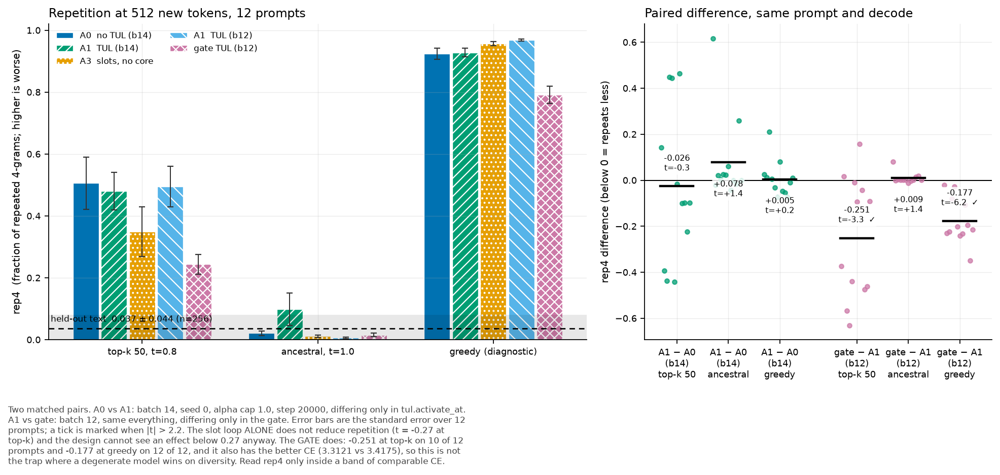

# Repetition with and without TUL, under sampled decoding

Status: exploratory measurement (not pre-registered — see "Process" at the end)

Wolfe, 2026-08-23: *"rep should be improved with TUL. The fact you got such a low number
on baseline is an outlier for sure. You did something wrong there. … Make sure you are
using sampled decoding."*

All three corrections were right, and the first two were the same bug twice.

## What was wrong with the previous table

[`2026-08-23-tul-gate-bakeoff.md`](2026-08-23-tul-gate-bakeoff.md) §Result 3 is
**withdrawn**. It had two defects that between them made it unable to answer the question
it was written for.

**1. There was no baseline in it.** Arm A0 sets `tul.activate_at: never` and therefore
builds no TUL parameters, so `build_tul_runtime` returned `None` and
`scripts/tul_samples.py` printed `SKIP: this arm builds no TUL layout` and moved on. The
table compared TUL against TUL. "Does the slot loop repeat less than a plain model" was
not in it and could not have been. A0 now decodes through `generate_plain`, the same
eager recompute-per-step loop as `generate_tul`, sharing one sampling step
(`morph/inference/sampling.py`) so the arms cannot differ by decoder.

**2. The reference number was a low draw from a floored distribution.** Real text was
scored as `rep4 = 0.003` from ONE batch of 8 rows at 128 tokens, with no spread. The same
corpus, 256 rows:

| tokens scored | rep4 mean | sd | median | rows at exactly 0.000 |
|---:|---:|---:|---:|---:|
| 128 | 0.0154 | 0.0385 | **0.0000** | **54 %** |
| 256 | 0.0252 | 0.0409 | 0.0119 | 16 % |
| 512 | **0.0365** | 0.0444 | 0.0236 | 1 % |

At 128 tokens the reference itself is on the floor more than half the time, and so was
every sampled model row in the old table (0.000–0.008). The metric had no resolution at
the only decode setting worth ranking on. Everything below is at **512 tokens**, and the
anchor is 256 rows with a standard deviation.

`morph/inference/gen_metrics.py` now takes an explicit `window`, and
`tests/test_generation_sampling.py` asserts that rep_n honours it and grows with it — the
property that makes cross-length comparison invalid.

## Method

`scripts/tul_samples.py`, 12 prompts × 512 new tokens, seed 1234, per-prompt values kept.
Sampled modes are reported first; greedy is a diagnostic that says whether an argmax loop
exists, not a ranking. Held-out anchor: 256 rows × 512 tokens, scored by the same code.
Data: [`tul_rep_ab.json`](tul_rep_ab.json).

The TUL arms are decoded with the slot budget widened from 64 to 136, because a 512-token
sample at the rule's `min_span` of 4 can need 128 slots and the builder raises rather than
silently dropping a boundary. `--assert-slot-invariance` greedy-decodes at both budgets
and requires identical tokens first; it passed on every TUL arm (48/48 tokens).

## Levels — rep4 / distinct3, higher rep4 is worse

| arm | batch | top-k 50, t=0.8 | ancestral, t=1.0 | greedy |
|---|---:|---:|---:|---:|
| held-out text | — | **0.0365 / 0.9276** | 0.0365 / 0.9276 | 0.0365 / 0.9276 |
| A0 no TUL | 14 | 0.5057 / 0.4528 | 0.0210 / 0.9647 | 0.9237 / 0.0676 |
| A1 TUL | 14 | 0.4799 / 0.4802 | 0.0986 / 0.8778 | 0.9283 / 0.0676 |
| A3 slots, no core | 14 | 0.3487 / 0.5820 | 0.0111 / 0.9732 | 0.9569 / 0.0417 |
| A1 TUL | 12 | 0.4951 / 0.4456 | 0.0062 / 0.9825 | 0.9681 / 0.0304 |
| **gate TUL** | 12 | **0.2439 / 0.6775** | 0.0156 / 0.9632 | **0.7914 / 0.1690** |

The headline that the 128-token table could not see: at the decode setting the training
loop itself uses, these models repeat **13×** more than held-out text (0.51 vs 0.037).
That is a property of 20k-step 285M models, not of TUL — but it was invisible before.

## Paired differences — the actual question

12 prompts, same prompt and decode on both sides. Negative means the second arm repeats
less. MDE is the smallest effect this design can detect at 80 % power.

| comparison | decode | difference | t | better on | MDE |
|---|---|---:|---:|---:|---:|
| A1 − A0 (b14, matched) | top-k 50 | −0.0259 ± 0.0972 | −0.27 | 8/12 | 0.272 |
| A1 − A0 (b14, matched) | ancestral | +0.0776 ± 0.0539 | +1.44 | 4/12 | 0.151 |
| A1 − A0 (b14, matched) | greedy | +0.0046 ± 0.0228 | +0.20 | 6/12 | 0.064 |
| **gate − A1 (b12, matched)** | **top-k 50** | **−0.2511 ± 0.0768** | **−3.27** | **10/12** | 0.215 |
| gate − A1 (b12, matched) | ancestral | +0.0093 ± 0.0069 | +1.36 | 2/12 | 0.019 |
| **gate − A1 (b12, matched)** | **greedy** | **−0.1767 ± 0.0283** | **−6.24** | **12/12** | 0.079 |
| A3 − A0 (b14, matched) | top-k 50 | −0.1570 ± 0.1179 | −1.33 | 9/12 | 0.330 |

### The slot loop alone: no detectable effect

A1 − A0 is indistinguishable from zero at every mode. The top-k direction favours TUL
(8 of 12 prompts, −0.026) and the ancestral direction opposes it (4 of 12, +0.078), and
neither is close to significance. **This is a null with a very wide error bar, not
evidence of no effect**: rep4 has a per-sample paired sd of 0.337 at top-k, so n=12 can
only resolve an effect of 0.272 and the effect present is ten times smaller. Detecting
0.026 at 80 % power needs about **1330 samples**, which at 33 s per 512-token generation
is a ~12-hour job per arm.

Batching would have paid for that, and it was built and then rejected: the batch-parity
gate showed ragged batched decoding is not equivalent on this architecture. That
investigation is what turned up the causality defect below.

### The gate: a real reduction, and it is not the diversity trap

gate − A1 is significant at both argmax-adjacent modes and consistent across prompts:
10 of 12 at top-k, **12 of 12 at greedy**. `distinct3` agrees independently (0.678 vs
0.446 at top-k; 0.169 vs 0.030 at greedy).

The check that matters: **the gate also has the better CE** — 3.3121 against A1's 3.4175.
So this is not the failure mode where a degenerate model wins on diversity because
incoherent text never repeats. That trap is real and was hit in the withdrawn table,
where a diverged arm at CE 6.43 scored the best rep4 of any arm. Here both axes point the
same way, which is what makes the gate result readable.

A mechanism is available and was not tested here: the gate trains a span-length head and
conditions the coda on a length budget (`docs/tul-gate-spec.md` §5, §8), which is directly
a "stop running on" signal. Whether the budget conditioning is what does it, rather than
the extra parameters or the auxiliary loss, needs an arm with the head trained and the
conditioning disabled.

## Caveats

- Every arm here carries the causality defect in
  [`.agents/notes/implemented/bug-fix/2026-08-23-retention-carry-breaks-causality.md`](../../../.agents/notes/implemented/bug-fix/2026-08-23-retention-carry-breaks-causality.md):
  `retention_carry: true` lets every position read the whole sequence from core iteration 2
  onward, worth +0.1433 nats of teacher-forced CE. Generation cannot use that lookahead,
  which is the most likely reason a model at PPL 27 emits rep4 0.51. **The repetition
  levels in this note are therefore a property of a leaky model**; the arm-vs-arm
  differences survive because every arm leaks equally.
- The two matched pairs come from different campaigns: A0/A1 at batch 14 (08-18) and
  A1/gate at batch 12 (08-23). A gate-vs-A0 number is NOT available at matched settings.
- 12 handwritten prompts, one draw each. They are not drawn from the validation
  distribution.
- Greedy is reported for completeness. It ranks arms by argmax-basin geometry and should
  never carry a conclusion on its own.

## Not verified

- Whether the gate's advantage survives at n large enough to also resolve the A1 − A0
  effect, and whether it holds on prompts drawn from held-out text rather than written by
  hand.
- Whether any of this changes once the causality defect is fixed. It plausibly changes a
  lot: the leak is exactly the kind of thing that lets teacher forcing hide a
  run-on habit.
- MAUVE, gen-PPL under an external scorer, and human reading beyond the samples quoted in
  the withdrawn table.

## Process

This was a re-measurement ordered to correct a defective one, so it has no pre-registered
prediction file, and `lab/experiments/AGENTS.md` requires one for a hypothesis test. The
gate-vs-A1 repetition result is therefore **exploratory**: it was found by looking, not
predicted in advance. It needs a pre-registered confirmation before it is cited as
established.
